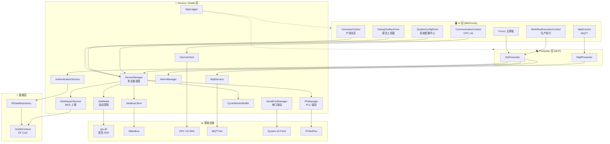
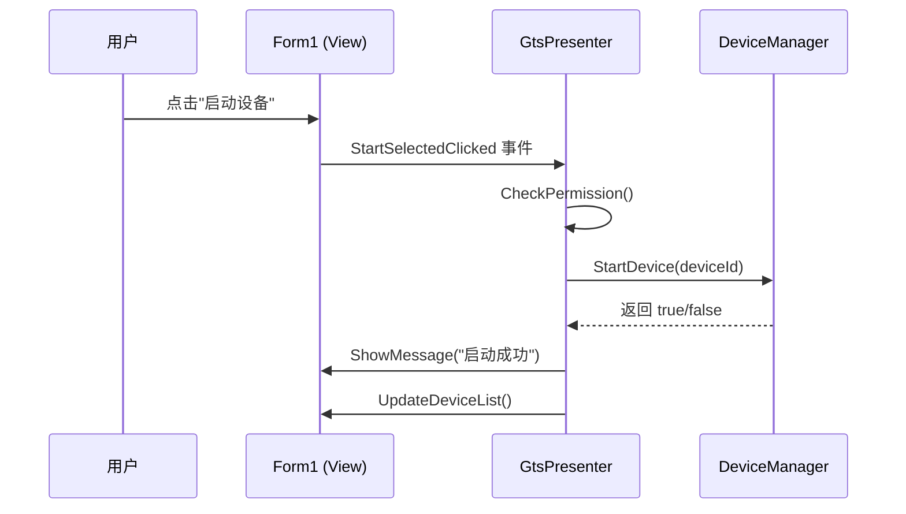
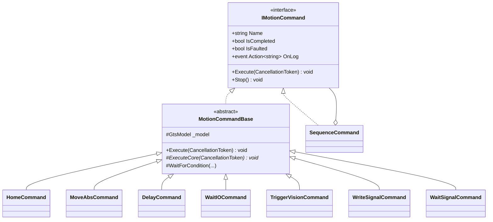
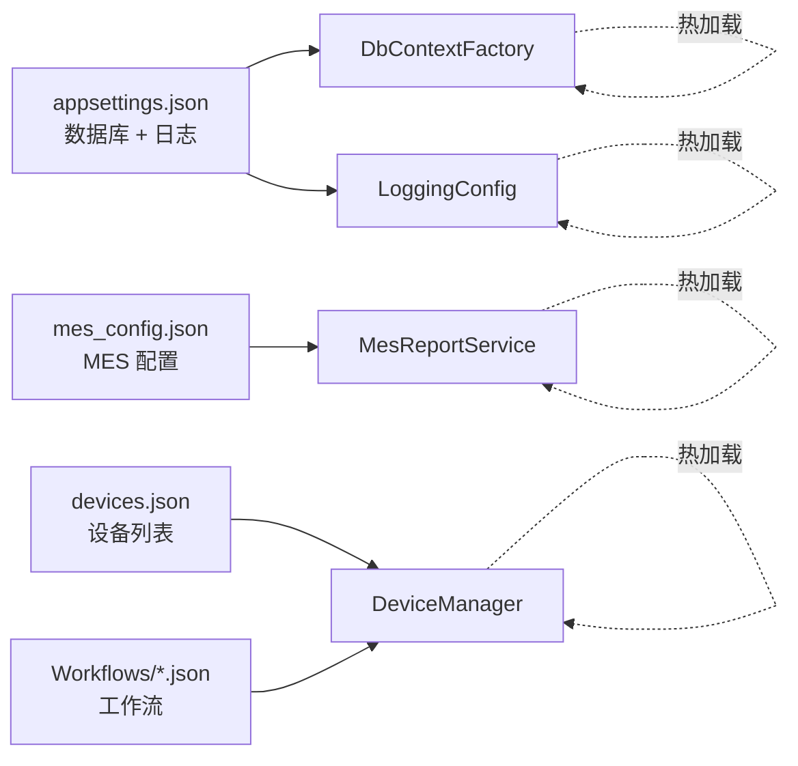
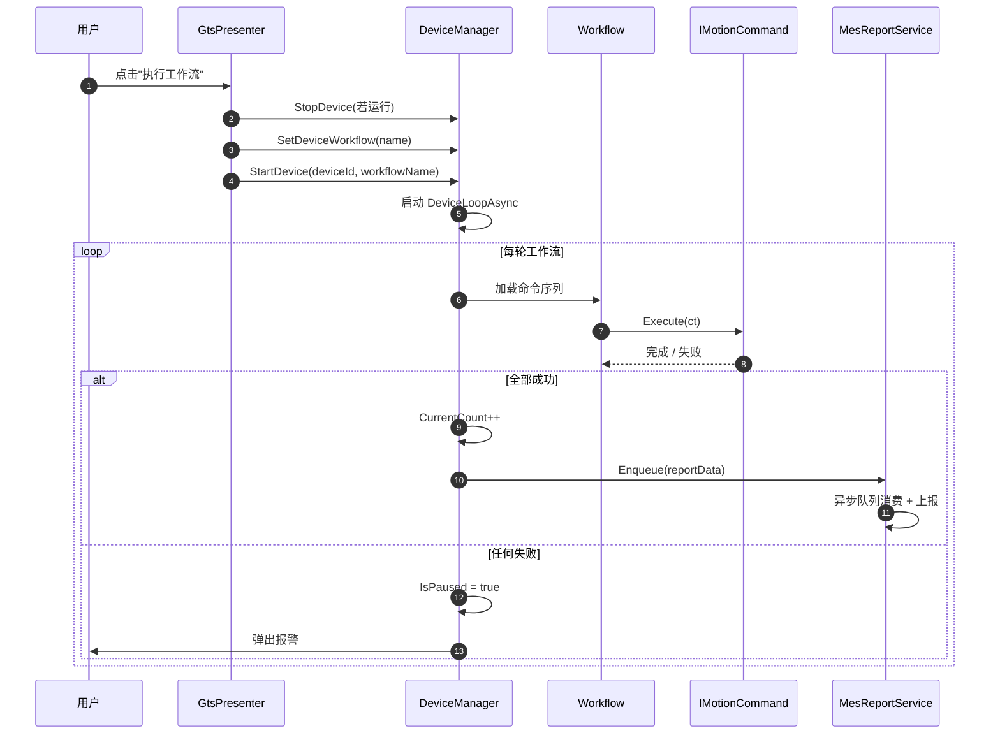
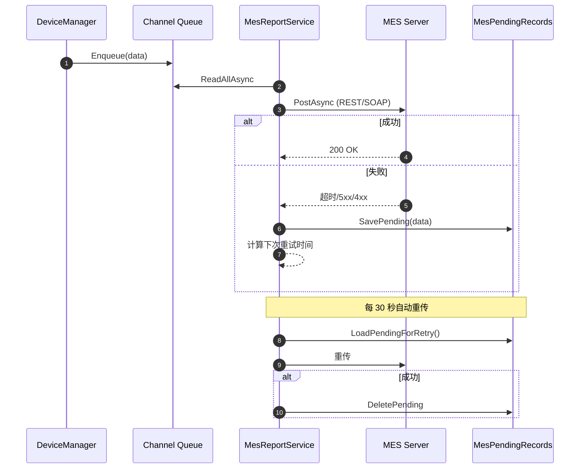

# 系统架构说明

## 1. 概述

GTS 产线控制系统是一个基于 **.NET 8.0 WinForms** 的多设备并行控制与监控平台，采用 **MVP 架构**，通过分层设计实现 UI、业务逻辑、硬件驱动的完全解耦。

主要能力：

- 运动控制（固高 GTS 系列控制卡）
- 多协议通信（Modbus / OPC UA / MQTT / SIEMENS S7 / 串口）
- 工作流编排（JSON 命令序列）
- 机器视觉触发（Modbus 对接 HalconVisionServer）
- MES 上报（REST + SOAP 双协议）
- 用户权限审计、报警管理、黑匣子日志

## 2. 分层架构



## 3. 模块职责

| 模块 | 位置 | 职责 |
|------|------|------|
| **GtsPresenter** | `Presenters/` | MVP 核心调度，桥接 UI 与 Service |
| **DeviceManager** | `Core/` | 多设备并行调度、工作流循环、MES 触发 |
| **GtsModel** | `Core/` | 固高 GTS SDK 的封装，支持模拟/真实切换 |
| **Watchdog** | `Core/` | 通信健康监控看门狗 |
| **AppLogger** | `Core/` | 基于 Channel 的异步日志系统 |
| **CyclicMonitorBuffer** | `Core/` | 30000 条循环内存缓冲区（黑匣子） |
| **ModbusClient** | `Modbus/` | Modbus TCP/RTU 客户端 |
| **OpcUaClient** | `Services/OpcUa/` | OPC UA 客户端（连接/读写/订阅） |
| **MqttService** | `Services/` | MQTT 客户端 |
| **PlcManager** | `Services/Plc/` | 多 PLC 管理 + 西门子 S7 驱动 |
| **SerialPortManager** | `Services/Serial/` | 多串口管理 + 4 种帧格式解析 |
| **MesReportService** | `Services/Mes/` | MES 双协议上报 + 异步队列 + 离线缓存 |
| **MesHealthMonitor** | `Services/Mes/` | MES 端点健康监控 |
| **EfDataRepository** | `Data/` | EF Core 多数据库仓储 |
| **DbContextFactory** | `Data/` | 数据库工厂，支持 SQLite/SqlServer/MySQL |

## 4. 关键设计模式

### 4.1 MVP（Model-View-Presenter）



**优点**：
- View 层只负责 UI，不包含业务逻辑
- Presenter 可以独立测试
- 更换 UI 框架（WinForms → WPF）不需要改动 Presenter

### 4.2 命令模式（Command Pattern）

工作流中的每个步骤是一个 `IMotionCommand` 实现：



### 4.3 工厂模式（Factory Pattern）

`CommandFactory.Create()` 根据 `CommandConfig.Type` 动态创建命令对象：

```csharp
"Home"          → new HomeCommand(...)
"MoveAbs"       → new MoveAbsCommand(...)
"Delay"         → new DelayCommand(...)
"WaitIO"        → new WaitIOCommand(...)
"TriggerVision" → new TriggerVisionCommand(...)
"WriteSignal"   → new WriteSignalCommand(...)
"WaitSignal"    → new WaitSignalCommand(...)
```

### 4.4 策略模式（Strategy Pattern）

- `ISerialFrameParser` → `FixedLengthParser` / `LengthFieldParser` / `DelimiterParser`
- `IPlcClient` → `SiemensS7Client` / `SimulatedPlcClient`
- `IDataRepository` → `EfDataRepository`（新）/ `SqliteRepository`（旧）

## 5. 线程模型

| 线程 | 职责 | 生命周期 |
|------|------|----------|
| **UI 线程** | 界面渲染、用户交互 | 程序全程 |
| **设备循环线程** | 每台设备一个 `Task.Run` 执行工作流 | `StartDevice` → `StopDevice` |
| **看门狗线程** | 每台设备独立，检查通信健康 | 工作流运行期间 |
| **GrabLoop 线程** | 相机采集循环 | 相机连接期间 |
| **日志写线程** | `Channel` 消费 + 文件写入 | `Initialize` → `Shutdown` |
| **MES 消费线程** | `Channel` 消费 + 上报 | `MesReportService` 生命周期 |
| **MES 重传线程** | 定期重传待上报数据 | `MesReportService` 生命周期 |
| **MES 健康监控线程** | 每 10 秒探测 MES 端点 | `MesHealthMonitor` 生命周期 |
| **串口读取线程** | 事件 + 20ms 轮询双通道 | `SerialPortDriver.Open()` 期间 |
| **PLC 自动重连线程** | 连接失败时定时重试 | `SiemensS7Client` 生命周期 |

## 6. 配置驱动

系统完全由配置文件驱动：



**热加载按钮**（系统工具页）：一键重载所有配置，无需重启程序。

## 7. 数据流

### 7.1 工作流执行流程



### 7.2 MES 上报流程



## 8. 目录结构对照

| 目录 | 说明 |
|------|------|
| `Core/` | 核心基础设施（日志、看门狗、设备管理、运动模型） |
| `Commands/` | 工作流命令（命令模式） |
| `Controls/` | UI 用户控件 |
| `Data/` | EF Core 数据层（DbContext + Repository + 配置） |
| `Forms/` | WinForms 窗体 |
| `Modbus/` | Modbus 通信模块 |
| `Models/` | 数据模型 |
| `Presenters/` | MVP Presenter |
| `Services/` | 业务服务（报警/认证/MES/PLC/串口/OPC UA/MQTT） |
| `Utils/` | 工具类 |

## 9. 扩展点

| 扩展点 | 位置 | 方法 |
|--------|------|------|
| **新增工作流命令** | `Commands/` | 实现 `IMotionCommand`，在 `CommandFactory` 注册 |
| **新增 PLC 品牌** | `Services/Plc/` | 实现 `IPlcClient`，在 `PlcManager.CreateClient` 注册 |
| **新增数据库** | `Data/DbContextFactory.cs` | 在 `ConfigureOptions` 添加 `case` |
| **新增 MES 协议** | `Services/Mes/MesReportService.cs` | 添加 `PostToMesByXxxAsync` 方法 |
| **新增串口帧格式** | `Services/Serial/Frames/` | 实现 `ISerialFrameParser`，在 `CreateParser` 注册 |