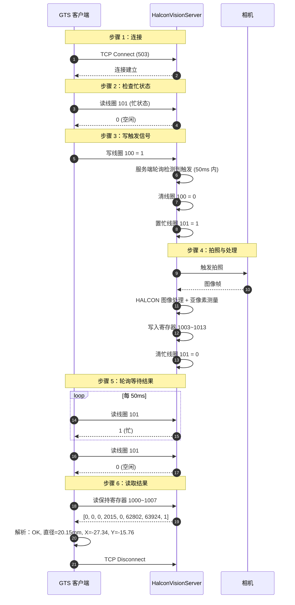

# Modbus 通信协议说明

## 1. 概述

本系统使用 Modbus 协议对接两类设备：

| 场景 | 角色 | 协议 | 用途 |
|------|------|------|------|
| **产线设备**（PLC / 传感器 / 执行器） | **客户端**（Master） | Modbus TCP / RTU | 读写线圈、寄存器 |
| **视觉服务器**（HalconVisionServer） | **客户端**（Master） | Modbus TCP | 触发拍照 + 读取测量结果 |

> 视觉服务器的 Modbus **从站**运行在 HalconVisionServer 中，监听 `503` 端口（可配置）。

## 2. 视觉服务器寄存器映射

### 2.1 线圈（Coils）

| 地址 | 名称 | 读/写 | 说明 |
|------|------|-------|------|
| **100** | 触发线圈 | W | 客户端写 `1` 触发拍照；服务端处理完自动清 `0` |
| **101** | 忙状态 | R | `1` = 正在处理；`0` = 空闲 |
| **102** | 整体结果 | R | `1` = OK；`0` = NG |

### 2.2 单目标保持寄存器（Holding Registers）

| 地址 | 名称 | 类型 | 说明 |
|------|------|------|------|
| **1000** | 结果码 | UInt16 | `0`=OK, `3`=NG, `1`=故障, `2`=相机未连接, `99`=系统错误 |
| **1001** | 文件名首字节 | UInt16 | ASCII 字符 |
| **1002** | 文件名第二字节 | UInt16 | ASCII 字符 |
| **1003** | **直径 × 100** | UInt16 | 例如 `2015` = `20.15 mm` |
| **1004** | 缺陷数 | UInt16 | 缺陷计数 |
| **1005** | **X 坐标 × 100** | Int16 (有符号) | 例如 `-2734` = `-27.34 mm` |
| **1006** | **Y 坐标 × 100** | Int16 (有符号) | 例如 `-1576` = `-15.76 mm` |
| **1007** | 目标数量 | UInt16 | 检测到的目标个数 |

### 2.3 多目标保持寄存器

| 地址 | 名称 | 说明 |
|------|------|------|
| **1010** + i×4 | 第 i 个目标的直径 × 100 | i 从 0 开始 |
| **1011** + i×4 | 第 i 个目标的 X 坐标 × 100 | 有符号 |
| **1012** + i×4 | 第 i 个目标的 Y 坐标 × 100 | 有符号 |
| **1013** + i×4 | 第 i 个目标的 OK 标志 | 1=OK, 0=NG |

> 多目标区最多支持 20 个目标，地址范围 `1010` ~ `1089`。

## 3. 有符号数处理

Modbus 寄存器本身是**无符号 16 位**（0 ~ 65535），但坐标可能是负数。

**写入（服务端 → 寄存器）**：
```csharp
double value = -27.34;
ushort raw = (ushort)(short)Math.Round(value * 100, MidpointRounding.AwayFromZero);
// value * 100 = -2734, (short) = -2734, (ushort) = 62802 = 0xF552
_registers.WritePoints(1005, new ushort[] { raw });
```

**读取（寄存器 → 客户端）**：
```csharp
ushort raw = master.ReadHoldingRegisters(slave, 1005, 1)[0];
short signed = (short)raw;   // 0xF552 → -2734
double value = signed / 100.0;  // -27.34
```

⚠️ **注意**：`NModbus` 返回的 `ushort[]` **已经是寄存器内的原始值**，不要再做字节交换。常见错误是在读取时多交换一次字节：

```csharp
// ❌ 错误：多余的字节交换
result = (short)((raw << 8) | (raw >> 8));

// ✅ 正确：直接强转
result = (short)raw;
```

## 4. 通信时序

### 4.1 触发拍照流程



### 4.2 超时与重试策略

| 阶段 | 超时 | 重试 |
|------|------|------|
| TCP 连接 | 3000 ms | 3 次 |
| 读忙状态 | 3000 ms | 3 次（每次间隔 500ms） |
| 等待处理完成 | 10000 ms | 轮询间隔 50ms |
| 读结果寄存器 | 3000 ms | 1 次 |

**超时处理**：
- 连接超时 → 抛异常，工作流暂停
- 忙状态检查超时 → 抛异常
- 处理超时 → 抛异常，工作流暂停
- 通信中断 → 尝试重连一次

## 5. 代码示例

### 5.1 使用 ModbusClient 触发视觉

```csharp
var config = new ModbusConfig
{
    Protocol = ModbusProtocol.Tcp,
    IpAddress = "127.0.0.1",
    Port = 503,
    SlaveAddress = 1,
    TimeoutMs = 3000
};

using var client = new ModbusClient(config);
if (!client.Connect()) return;

// 写触发线圈
client.WriteSingleCoil(100, true);

// 轮询忙状态
var sw = Stopwatch.StartNew();
bool isBusy = true;
while (isBusy && sw.ElapsedMilliseconds < 10000)
{
    var status = client.ReadDataByType(101, 1);
    isBusy = status.RawRegisters[0] == 1;
    Thread.Sleep(50);
}

// 读结果
var resultCode = client.ReadHoldingRegisters(1000, 1);      // 0 = OK
var diameter   = client.ReadHoldingRegisters(1003, 1);      // 2015 = 20.15mm
var xRaw       = client.ReadHoldingRegisters(1005, 1);      // 62802
short xSigned  = (short)((ushort[])xRaw)[0];                // -2734
double x       = xSigned / 100.0;                           // -27.34mm

client.Disconnect();
```

### 5.2 TriggerVisionCommand 工作流命令

工作流 JSON 中的 `TriggerVision` 命令自动完成上述所有步骤：

```json
{
  "Type": "TriggerVision",
  "VisionServerIp": "127.0.0.1",
  "VisionServerPort": 503,
  "TriggerCoilAddress": 100,
  "BusyCoilAddress": 101,
  "ResultCoilAddress": 102,
  "ResultCodeRegister": 1000,
  "FileNameRegisterStart": 1001,
  "VisionTimeoutMs": 10000
}
```

## 6. 客户端配置（产线设备）

### 6.1 Modbus TCP

```json
{
  "Protocol": "Tcp",
  "IpAddress": "192.168.1.10",
  "Port": 502,
  "SlaveAddress": 1,
  "TimeoutMs": 3000,
  "AddressType": "HoldingRegister",
  "DataType": "Int16",
  "ByteOrder": "BigEndian",
  "StartAddress": 0,
  "RegisterCount": 10
}
```

### 6.2 Modbus RTU

```json
{
  "Protocol": "Rtu",
  "PortName": "COM3",
  "BaudRate": 9600,
  "DataBits": 8,
  "StopBits": "One",
  "Parity": "None",
  "SlaveAddress": 1,
  "TimeoutMs": 3000
}
```

## 7. 字节序（ByteOrder）说明

**仅对多寄存器类型（Int32 / Float / Double）有效**：

| 字节序 | 说明 | 举例（值 = `0x12345678`） |
|--------|------|---------------------------|
| **BigEndian** | 高字节在前 | 寄存器：`0x1234`, `0x5678` |
| **LittleEndian** | 低字节在前 | 寄存器：`0x5678`, `0x1234` |

**注意**：Int16 / UInt16 是单寄存器类型，字节序无影响。

## 8. 常见错误排查

| 现象 | 原因 | 解决方案 |
|------|------|----------|
| **连不上 503 端口** | 端口被 Modbus Slave 占用 | 关闭 Modbus Slave，改用 Modbus Poll |
| **读到全 0** | 未触发拍照 / 从站未写入 | 先写线圈 100 = 1 触发一次 |
| **读到 540.23 而非 20.03** | 客户端做了多余字节交换 | 去掉 `ConvertRawToType` 的字节交换 |
| **坐标显示 62802 而非 -27.34** | 未做有符号转换 | 读取后 `(short)raw` |
| **值误差 0.01mm** | 服务端用截断而非四舍五入 | 服务端改 `Math.Round` |

## 9. 与 GTS 客户端的对接约定

| 项目 | 值 |
|------|------|
| **协议** | Modbus TCP |
| **端口** | 503（可在 `vision_config.json` 中改） |
| **从站 ID** | 1 |
| **触发方式** | 写线圈 100 = 1 |
| **数据格式** | 直径/坐标 × 100 存储，坐标有符号 |
| **字节序** | 大端（Modbus 标准） |
| **超时** | 10 秒（可配置） |