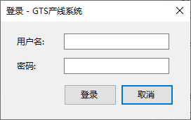
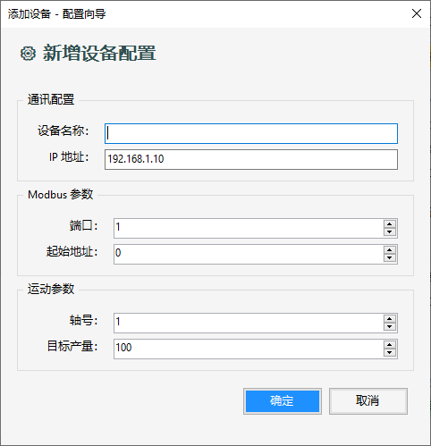
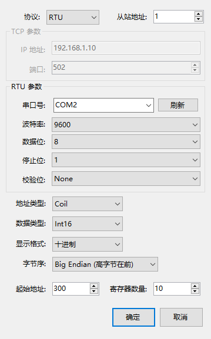

# GTS 产线控制系统

[](https://dotnet.microsoft.com/)
[](LICENSE)
[]()

基于 **.NET 8.0 WinForms** 的多设备并行控制与监控平台，专为 **固高 GTS 系列运动控制卡** 设计。  
集成 Modbus TCP/RTU 通信、工作流编排、报警管理、用户权限审计及黑匣子日志，适用于产线自动化与测试台架。

---

## 界面预览

| 主操作界面 | 登录界面 |
|:---:|:---:|
|  |  |

| 添加设备配置 | Modbus 高级配置 |
|:---:|:---:|
|  |  |

---

## 功能特性

| 模块 | 描述 | 状态 |
|------|------|------|
| **多设备管理** | 动态增删设备，每台独立配置（IP、端口、轴号、目标产量），在线/离线状态指示灯。 | ✅ 已完成 |
| **运动控制** | 回零、绝对定位、点动（Jog+ / Jog-）、伺服使能/去使能、急停、软限位、报警复位。 | ✅ 已完成 |
| **Modbus 通信** | 支持 TCP/RTU 协议，读写线圈、保持寄存器、输入寄存器、离散输入；支持 Int16/32、Float、Double 数据类型及大/小端字节序。 | ✅ 已完成 |
| **工作流引擎** | JSON 配置文件定义顺序命令（Home、MoveAbs、WaitIO、Delay），动态加载。 | ✅ 已完成 |
| **实时监控** | 后台多线程高频轮询轴位置、速度、加速度及 Modbus 数据，趋势图实时更新。 | ✅ 已完成 |
| **黑匣子缓冲区** | 内存循环存储最近 30000 条监控记录，一键导出为文本文件。 | ✅ 已完成 |
| **双日志系统** | 操作日志与监控日志分栏显示，按日期/大小滚动落盘，自动清理过期文件。 | ✅ 已完成 |
| **报警管理** | 触发、确认、解决报警，按严重等级分类，SQLite 持久化。 | ✅ 已完成 |
| **用户权限与审计** | 基于角色（Admin/Engineer/Operator）的访问控制，关键操作记录审计日志。 | ✅ 已完成 |
| **模拟/真实切换** | 无需硬件即可在模拟模式下完整运行，一键切换时自动检测固高卡。 | ✅ 已完成 |
| **设备看门狗** | 每台设备独立看门狗，监控 Modbus 通信健康状态，超时自动重连或报警。 | ✅ 已完成 |
| **配置导入导出** | 设备配置可导出为 `devices.json` 文件，支持导入恢复。 | ✅ 已完成 |

---

## 技术架构

| 方面 | 实现 |
|------|------|
| **架构模式** | MVP（Model‑View‑Presenter）+ 被动视图 |
| **设计模式** | 命令模式（Command Pattern） |
| **多线程** | 独立后台轮询线程 + CancellationToken 工作流取消 |
| **模拟器** | `GtsModel` 层完全模拟固高 API |
| **硬件抽象** | `gts.cs` P/Invoke（需从固高 SDK 获取） |
| **配置驱动** | `devices.json` + `Workflows/*.json` |
| **Modbus 集成** | [NModbus](https://github.com/NModbus/NModbus) 库 |
| **循环缓冲区** | `ConcurrentQueue` 线程安全 |
| **日志系统** | `AppLogger` 静态类，线程安全，滚动清理 |
| **数据持久化** | SQLite（异步写入） |
| **看门狗** | 独立监控任务 |

---

## 工作流配置格式

工作流使用 **JSON** 格式定义，存放在 `Workflows/` 目录下。程序启动时会自动扫描该目录，将每个 `.json` 文件作为一个独立的工作流选项显示在界面的下拉列表中。

### 文件结构

```json
{
  "Name": "工作流名称",
  "Description": "工作流描述（可选）",
  "Commands": [
    { "Type": "命令类型", "参数1": "值1", "参数2": "值2" },
    { "Type": "命令类型", "参数1": "值1", "参数2": "值2" }
  ]
}
```

### 完整示例：焊接工作流

```json
{
  "Name": "焊接流程",
  "Description": "标准焊接工序：回零 → 定位 → 等待IO → 延时",
  "Commands": [
    {
      "Type": "Home",
      "Axis": 1,
      "HomePos": 0
    },
    {
      "Type": "MoveAbs",
      "Axis": 1,
      "TargetPos": 10000,
      "Vel": 20.0,
      "Acc": 10.0
    },
    {
      "Type": "WaitIO",
      "IoIndex": 0,
      "ExpectValue": true
    },
    {
      "Type": "Delay",
      "DelayMs": 500
    }
  ]
}
```

### 命令类型详解

| 命令类型 | 参数 | 类型 | 说明 |
|----------|------|------|------|
| **Home** | `Axis` | int | 轴号（1~8） |
| | `HomePos` | int | 回零目标位置（脉冲数），默认 0 |
| **MoveAbs** | `Axis` | int | 轴号（1~8） |
| | `TargetPos` | int | 目标位置（脉冲数） |
| | `Vel` | double | 运行速度，默认 10.0 |
| | `Acc` | double | 加速度，默认 5.0 |
| **WaitIO** | `IoIndex` | int | IO 索引号（从 0 开始） |
| | `ExpectValue` | bool | 期望值（true/false），超时 5 秒 |
| **Delay** | `DelayMs` | int | 延时毫秒数 |

### 多设备复用

`Axis` 参数是**占位符**。当工作流在某个设备上执行时，系统会自动将 `Axis` 替换为该设备配置的轴号。  
因此，同一个工作流文件可以应用于不同设备，无需为每台设备单独编写。

> 💡 设备1配置轴号为1，设备2配置轴号为2，同一个 `Home` 命令在设备1上执行轴1回零，在设备2上执行轴2回零。

### 添加新工作流

1. 在 `Workflows/` 目录下创建 `*.json` 文件
2. 按照上述格式编写命令序列
3. 重启程序或点击“运行流程”下拉列表即可看到新选项

> 程序启动时会自动扫描并缓存所有工作流文件，无需重新编译。

---

## 数据库设计

系统使用 **SQLite** 作为本地嵌入式数据库，文件名为 `gts.db`（自动创建于程序运行目录）。

### 表结构

#### 1. Users（用户表）

| 字段 | 类型 | 说明 |
|------|------|------|
| Id | INTEGER | 主键，自增 |
| Username | TEXT UNIQUE | 登录用户名 |
| PasswordHash | TEXT | SHA256 哈希密码 |
| Salt | TEXT | 密码盐值 |
| FullName | TEXT | 用户全名 |
| Role | TEXT | 角色：Admin / Engineer / Operator |
| IsActive | INTEGER | 是否启用（0=禁用，1=启用） |
| CreatedTime | TEXT | 创建时间（ISO 8601） |

**默认账户**：`admin / admin`（首次启动自动创建）

#### 2. AuditLogs（审计日志表）

| 字段 | 类型 | 说明 |
|------|------|------|
| Id | INTEGER | 主键，自增 |
| UserId | INTEGER | 操作用户 ID |
| Username | TEXT | 操作用户名 |
| ActionType | TEXT | 操作类型 |
| Detail | TEXT | 操作详情 |
| Timestamp | TEXT | 操作时间（ISO 8601） |

#### 3. ProductionRecords（生产记录表）

| 字段 | 类型 | 说明 |
|------|------|------|
| Id | INTEGER | 主键，自增 |
| DeviceId | TEXT | 设备 ID |
| Timestamp | TEXT | 记录时间（ISO 8601） |
| CurrentCount | INTEGER | 当前产量 |
| TargetCount | INTEGER | 目标产量 |

#### 4. AlarmRecords（报警记录表）

| 字段 | 类型 | 说明 |
|------|------|------|
| Id | INTEGER | 主键，自增 |
| DeviceId | TEXT | 关联设备 ID |
| Message | TEXT | 报警消息 |
| Severity | TEXT | 严重等级 |
| Timestamp | TEXT | 触发时间（ISO 8601） |
| IsAcknowledged | INTEGER | 是否已确认 |
| IsResolved | INTEGER | 是否已解决 |
| AcknowledgedBy | TEXT | 确认人 |
| ResolvedBy | TEXT | 解决人 |
| AcknowledgedTime | TEXT | 确认时间 |
| ResolvedTime | TEXT | 解决时间 |

---

## 项目结构（核心）

```text
GtsTest/
├── Commands/                     # 工作流命令
│   ├── CommandConfig.cs
│   ├── CommandFactory.cs
│   ├── DelayCommand.cs
│   ├── HomeCommand.cs
│   ├── IMotionCommand.cs
│   ├── MotionCommandBase.cs
│   ├── MoveAbsCommand.cs
│   ├── SequenceCommand.cs
│   ├── WaitIOCommand.cs
│   └── WorkflowConfig.cs
├── Modbus/                       # Modbus 通信
│   ├── ModbusClient.cs
│   ├── ModbusConfig.cs
│   ├── ModbusConfigForm.cs
│   ├── ModbusConnectionEventArgs.cs
│   └── ModbusFormatter.cs
├── Presenters/                   # MVP Presenter 层
│   ├── GtsPresenter.cs
│   └── IGtsView.cs
├── Services/                     # 服务接口与实现
│   ├── AlarmManager.cs           # ✅ 报警管理
│   ├── AlarmRecord.cs            # ✅ 报警模型
│   ├── AppLoggerWrapper.cs       # ✅ 日志包装器
│   ├── AuditService.cs           # ✅ 审计服务
│   ├── AuthenticationService.cs  # ✅ 认证服务
│   ├── IAlarmManager.cs          # ✅ 报警接口
│   ├── IAuthenticationService.cs # ✅ 认证接口
│   ├── IDataRepository.cs        # ✅ 数据接口
│   ├── ILogger.cs                # ✅ 日志接口
│   ├── IMqttPublisher.cs         # ⏳ 待实现
│   ├── IOpcUaClient.cs           # ⏳ 待实现
│   ├── IRecipeManager.cs         # ⏳ 待实现
│   ├── SessionManager.cs         # ✅ 会话管理
│   ├── SqliteRepository.cs       # ✅ SQLite 实现
│   └── User.cs                   # ✅ 用户模型
├── AppLogger.cs                  # 全局日志
├── CyclicMonitorBuffer.cs        # 黑匣子缓冲区
├── DeviceManager.cs              # 设备管理
├── DeviceConfigForm.cs           # 设备配置 UI
├── GtsModel.cs                   # 运动控制模型（含模拟）
├── Watchdog.cs                   # 看门狗
├── Form1.cs                      # 主窗体（视图）
├── Program.cs                    # 入口
└── gts.cs                        # ⚠️ 固高 SDK（需自行获取）
```

---

## 待开发功能

以下功能模块的**接口已定义**，但**具体实现尚未完成**，欢迎贡献代码：

| 功能 | 接口/类 | 优先级 | 说明 |
|------|---------|--------|------|
| **MQTT 发布器** | `IMqttPublisher` | 中 | 将设备状态、报警、生产数据通过 MQTT 协议推送至云端或上位机监控系统。 |
| **OPC UA 客户端** | `IOpcUaClient` | 中 | 实现 OPC UA 通信，便于与 SCADA 系统（如 WinCC、组态王）集成。 |
| **配方管理** | `IRecipeManager` | 低 | 支持配方的新建、编辑、保存、加载及版本管理，适用于多品种生产切换。 |
| **报警 UI 确认/解决按钮** | `Form1` 事件绑定 | 中 | `AlarmAcknowledgeClicked` 和 `AlarmResolveClicked` 事件已在 Presenter 中订阅，但 UI 按钮尚未绑定。 |
| **Modbus 读取循环** | `DeviceManager.DeviceLoop` | 低 | 当前读取逻辑被注释，计划重构为可配置的读取策略（定时/触发/变化检测）。 |
| **工作流命令扩展** | `Commands/` | 低 | 计划新增命令：`SetDO`（写数字量输出）、`WaitModbus`（等待 Modbus 寄存器条件）、`Loop`（循环执行子命令）。 |
| **生产统计报表** | `Services/ReportService` | 低 | 按日/周/月生成产量报表，支持导出为 Excel 或 PDF。 |
| **远程诊断** | `Services/RemoteDiagnostic` | 低 | 通过 TCP/WebSocket 实现远程日志查看和诊断。 |

---

## 安装与运行

### 1. 获取固高 SDK（必须）

本仓库 **不包含** `gts.cs` 和 `gts.dll`（版权限制）。  
请从固高（Googol Technology）官网或配套光盘获取：

| 文件 | 位置 |
|------|------|
| `gts.cs` | 项目源代码目录（与 `GtsModel.cs` 同级） |
| `gts.dll` | 编译输出目录或系统 PATH |

> 仅模拟模式可省略 `gts.dll`，但 `gts.cs` 仍需存在。

### 2. 环境要求

- Windows 10/11（x86/x64）
- [.NET 8 SDK](https://dotnet.microsoft.com/download/dotnet/8.0)
- Visual Studio 2022 或 VS Code

### 3. 编译与运行

```bash
git clone https://github.com/yourusername/gts-production-line.git
cd gts-production-line
dotnet restore
dotnet build -c Release
dotnet run --project GtsTest.csproj
```

默认以 **模拟模式** 启动，无需硬件。

---

## 配置文件

| 文件/目录 | 用途 |
|-----------|------|
| `devices.json` | 设备配置，启动时自动加载，不存在则创建默认四台 |
| `Workflows/*.json` | 工作流定义，自动扫描填充下拉列表（格式详见上方说明） |
| `gts.db` | SQLite 数据库（自动创建） |
| `Logs/` | 日志目录，按日期滚动，自动清理 |

---

## 快速使用

1. **登录**：工具栏“登录”，默认 `admin/admin`
2. **添加设备**：填写名称、IP、端口、轴号、目标产量
3. **连接 Modbus**：选中设备，点击“连接 Modbus”或“全部连接”
4. **启动设备**：选中后点击“启动”（或“全部启动”）
5. **运行工作流**：点击“运行流程”，选择 JSON 工作流
6. **手动控制**：使用右侧轴控按钮
7. **Modbus 读写**：测试寄存器/线圈读写
8. **报警管理**：切换到“实时报警”标签页
9. **保存配置**：点击“保存配置”导出 `devices.json`

---

## 权限管理

| 角色 | 权限 |
|------|------|
| **未登录** | 大部分操作禁用 |
| **Admin** | 全部权限 |
| **Engineer** | 启动/停止设备、编辑配置（不能删除） |
| **Operator** | 仅启动/停止设备 |

所有关键操作写入审计日志。

---

## 贡献

欢迎提交 Issue 和 PR。  
新增命令类型：实现 `IMotionCommand` 并在 `CommandFactory` 中注册。  
待开发功能详见上方列表，欢迎认领。

---

## 许可证

[MIT](LICENSE)

---

## 联系

[GitHub Issues](https://github.com/...)