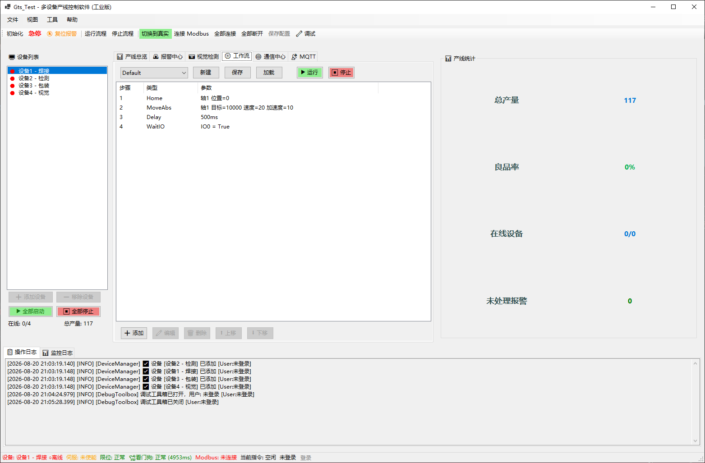
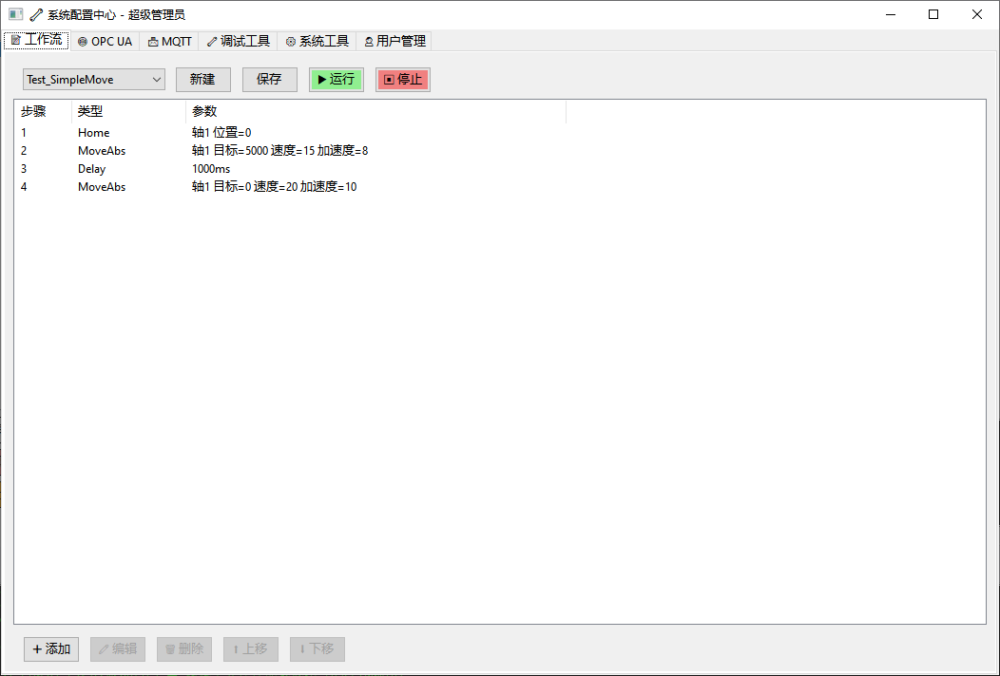
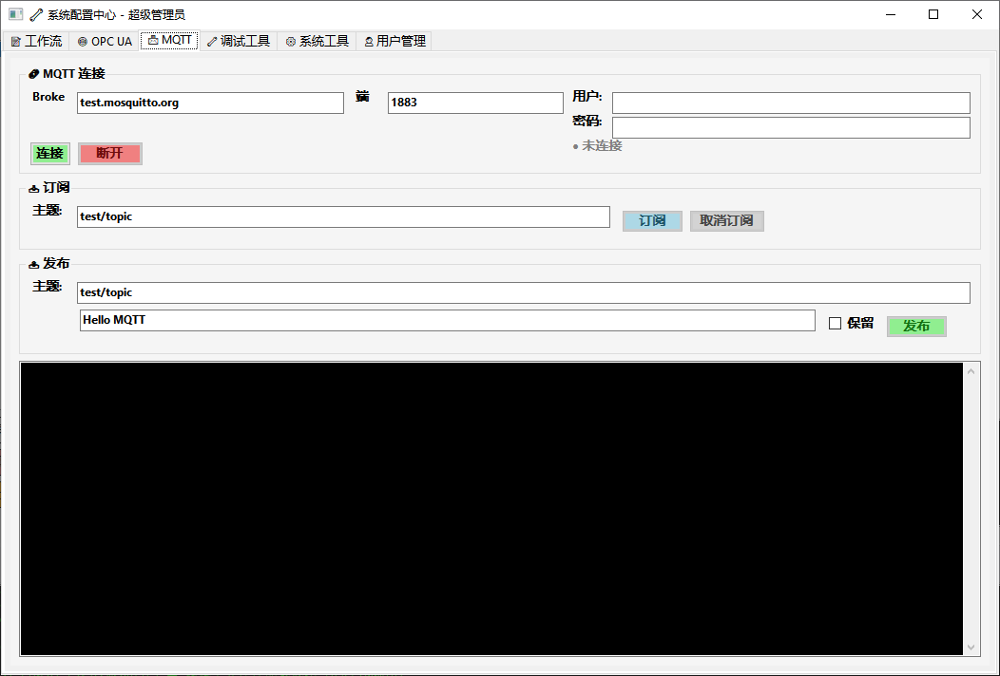
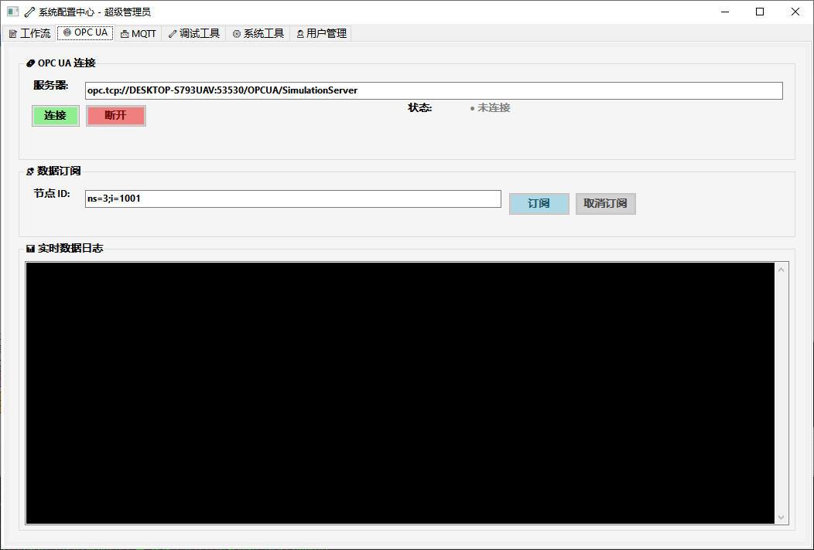
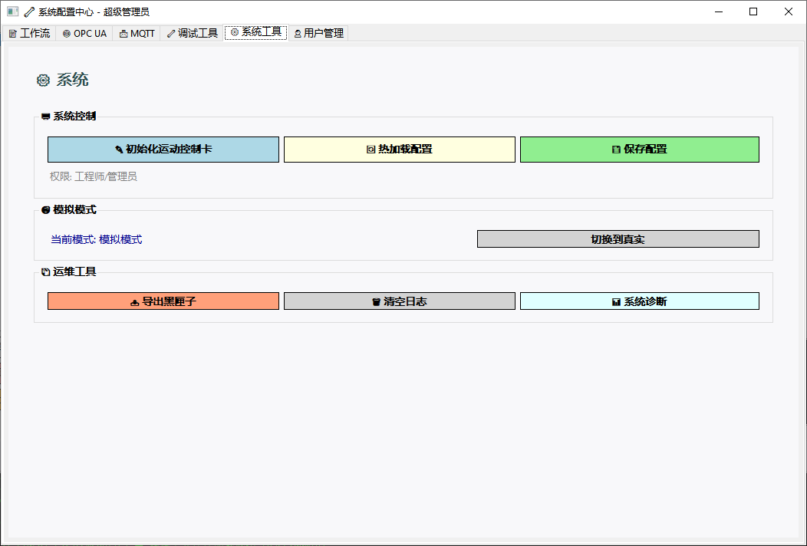
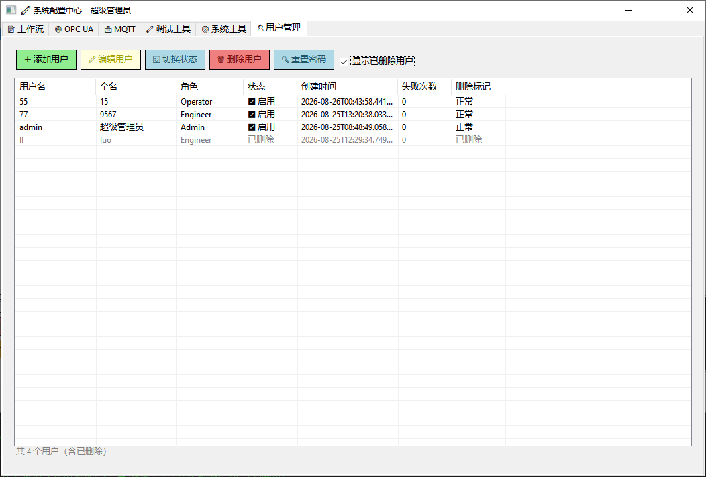
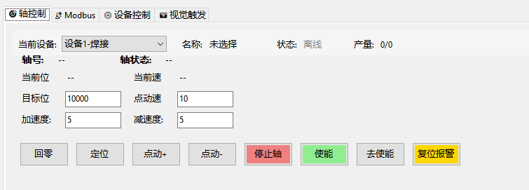
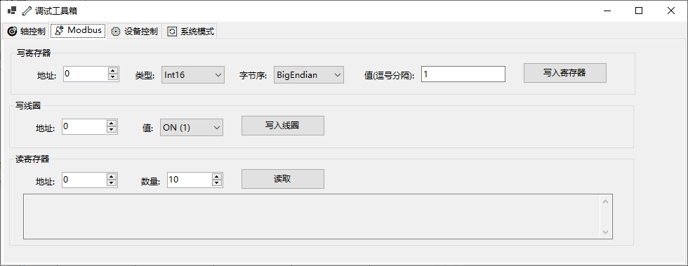
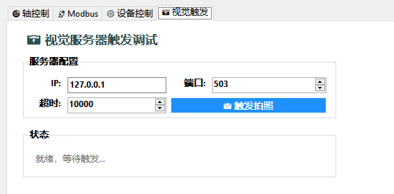
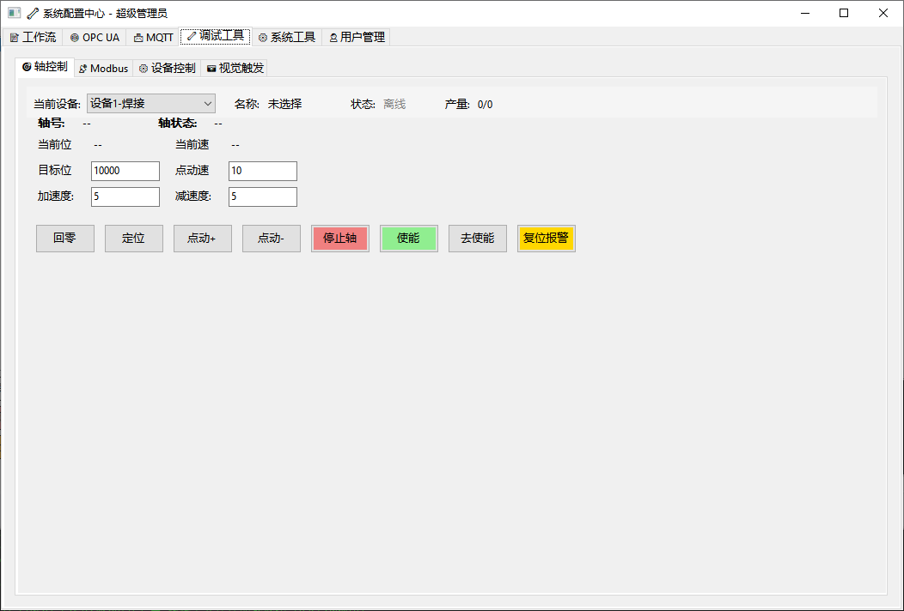

# GTS 产线控制系统

[](https://dotnet.microsoft.com/)
[](LICENSE)
[]()
[]()

基于 **.NET 8.0 WinForms** 的多设备并行控制与监控平台，专为 **固高 GTS 系列运动控制卡** 设计。  
集成 Modbus TCP/RTU、OPC UA、MQTT 通信、工作流编排、报警管理、用户权限审计及黑匣子日志，适用于产线自动化与测试台架。

---

## 📋 目录

- [界面预览](#-界面预览)
- [功能特性](#-功能特性)
- [技术架构](#-技术架构)
- [快速开始](#-快速开始)
- [工作流配置](#-工作流配置)
- [数据库设计](#-数据库设计)
- [项目结构](#-项目结构)
- [权限管理](#-权限管理)
- [通信协议](#-通信协议)
- [系统配置中心](#-系统配置中心)
- [配置文件说明](#-配置文件说明)
- [待开发功能](#-待开发功能)
- [贡献指南](#-贡献指南)
- [许可证](#-许可证)

---

## 🖼️ 界面预览

### 主界面与登录

| 主操作界面 | 登录界面 |
|:---:|:---:|
|  |  |
| 顶部标题栏、设备列表、产线监控/生产执行选项卡、操作日志/监控日志、状态栏 | 用户名/密码输入框，登录/取消按钮 |

**主界面说明：**
- **顶部栏**：标题、用户信息、登录/登出按钮、急停按钮、一键确认并解决所有活动报警按钮、系统管理按钮
- **左侧设备列表**：显示所有设备及在线状态（绿色/红色指示灯），支持添加/移除设备
- **中间区域**：产线监控（统计卡片、图表、设备详情）和生产执行（工作流选择与执行）两个选项卡
- **底部日志**：操作日志（黑色背景绿色文字）和监控日志（黑色背景青色文字）分栏显示
- **底部状态栏**：显示当前设备名称、伺服状态、限位状态、看门狗状态、Modbus 状态、当前指令

### 设备配置

| 添加设备配置 | Modbus 高级配置 |
|:---:|:---:|
|  |  |
| 设备名称、IP地址、Modbus端口、起始地址、轴号、目标产量 | 协议选择(TCP/RTU)、从站地址、TCP参数、RTU参数(串口/波特率/数据位/停止位/校验位)、地址类型、数据类型、显示格式、字节序、起始地址、寄存器数量 |

**设备配置说明：**
- 添加设备时需配置通讯参数（IP/端口）、Modbus 参数（起始地址/寄存器数量）和运动参数（轴号/目标产量）
- Modbus 高级配置支持 TCP 和 RTU 两种协议，完整的大端/小端字节序切换，以及 Coil/HoldingRegister/InputRegister/DiscreteInput 四种地址类型

### 核心功能模块

| 工作流编辑（主界面） | 工作流编辑（系统配置中心） |
|:---:|:---:|
|  |  |
| 主界面生产执行选项卡：工作流下拉选择、步骤列表、执行状态（空闲/当前步骤/进度/耗时） | 系统配置中心工作流编辑器：新建/保存/运行/停止、步骤增删改/上移下移 |

| MQTT 通信 | OPC UA 通信 |
|:---:|:---:|
|  |  |
| Broker地址/端口/用户名/密码、连接/断开、主题订阅/取消订阅、消息发布（含保留标志） | 服务器地址输入、连接/断开、节点ID订阅/取消订阅、实时数据日志显示 |

| 系统工具 | 用户管理 |
|:---:|:---:|
|  |  |
| 系统控制（初始化运动控制卡/热加载配置/保存配置）、模拟模式切换、运维工具（导出黑匣子/清空日志/系统诊断） | 用户列表（用户名/全名/角色/状态/创建时间/失败次数/删除标记）、添加/编辑/切换状态/删除/重置密码、显示已删除用户复选框 |

### 调试工具箱

调试工具箱是独立的调试窗体，**通过系统配置中心 → 调试工具 选项卡打开**，包含四个选项卡：

| 轴控制 | Modbus 调试 |
|:---:|:---:|
|  |  |
| 设备选择、轴号/轴状态/当前位置/当前速度显示、回零/定位/点动+/点动-/停止轴/使能/去使能/复位报警按钮 | 写寄存器（地址/类型/字节序/值）、写线圈（地址/ON/OFF）、读寄存器（地址/数量/结果显示） |

| 设备控制 | 视觉触发调试 |
|:---:|:---:|
|  |  |
| 单设备控制（启动设备/停止设备/配置）、Modbus 连接/断开 | 视觉服务器配置（IP/端口/超时）、触发拍照按钮、状态显示（就绪/触发中/成功/失败） |

> 💡 调试工具箱还包含 **系统模式** 选项卡（见下图），用于模拟/真实切换、热加载配置、保存配置、导出黑匣子。

| 系统模式 |
|:---:|
|  |
| 系统模式切换（模拟↔真实）、热加载配置、保存配置、导出黑匣子 |

---

## 🚀 功能特性

| 模块 | 描述 | 状态 |
|------|------|------|
| **多设备管理** | 动态增删设备，每台独立配置（IP、端口、轴号、目标产量），在线/离线状态指示灯 | ✅ |
| **运动控制** | 回零、绝对定位、点动（Jog+ / Jog-）、伺服使能/去使能、急停、软限位、报警复位 | ✅ |
| **Modbus 通信** | TCP/RTU 协议，读写线圈/寄存器/离散输入，支持 Int16/32、Float、Double 及大/小端字节序 | ✅ |
| **OPC UA 客户端** | 连接 OPC UA 服务器，读写节点值，订阅数据变化，支持浏览节点树 | ✅ |
| **MQTT 客户端** | 连接 Broker，订阅/发布主题，支持保留消息和 QoS | ✅ |
| **工作流引擎** | JSON 配置顺序命令（Home、MoveAbs、WaitIO、Delay、TriggerVision、WriteSignal、WaitSignal），动态加载，多设备复用 | ✅ |
| **视觉触发命令** | 通过 Modbus 触发视觉服务器拍照，自动等待结果并解析状态码 | ✅ |
| **跨设备信号交互** | 在工作流中读写其他设备的 Modbus 线圈，实现设备间联锁 | ✅ |
| **设备-工作流绑定** | 设备可预先绑定工作流，支持"全部启动"一键运行各设备配方 | ✅ |
| **实时监控** | 后台多线程高频轮询轴位置/速度/加速度及 Modbus 数据，趋势图实时更新 | ✅ |
| **黑匣子缓冲区** | 内存循环存储最近 30000 条监控记录，一键导出为文本文件 | ✅ |
| **双日志系统** | 操作日志与监控日志分栏显示，按日期/大小滚动落盘，自动清理过期文件 | ✅ |
| **报警管理** | 触发、确认、解决报警，按严重等级分类，SQLite 持久化（后端已完成，UI 待添加） | ⏳ |
| **用户权限与审计** | 基于角色（Admin/Engineer/Operator）的访问控制，关键操作记录审计日志，支持逻辑删除/恢复用户 | ✅ |
| **产量记录服务** | 异步记录产量更新到 SQLite，为报表统计提供数据基础 | ✅ |
| **模拟/真实切换** | 无需硬件即可在模拟模式下完整运行，一键切换时自动检测固高卡 | ✅ |
| **设备看门狗** | 每台设备独立看门狗，监控 Modbus 通信健康状态，超时自动重连或报警 | ✅ |
| **配置导入导出** | 设备配置可导出为 `devices.json` 文件，支持导入恢复 | ✅ |
| **调试工具箱** | 独立调试窗体，支持轴控、Modbus 读写、设备启停、系统模式切换、视觉触发调试、黑匣子导出 | ✅ |

---

## 🏗️ 技术架构

| 方面 | 实现 |
|------|------|
| **架构模式** | MVP（Model‑View‑Presenter）+ 被动视图 |
| **设计模式** | 命令模式（Command Pattern）、模板方法、观察者、工厂模式 |
| **多线程** | 独立后台轮询线程 + `CancellationToken` 工作流取消 |
| **模拟器** | `GtsModel` 层完全模拟固高 API，支持无硬件测试 |
| **硬件抽象** | `gts.cs` P/Invoke（需从固高 SDK 获取） |
| **配置驱动** | `devices.json` + `Workflows/*.json` |
| **Modbus 集成** | [NModbus](https://github.com/NModbus/NModbus) 库 |
| **OPC UA 集成** | [OPC Foundation .NET Standard](https://github.com/OPCFoundation/UA-.NETStandard) |
| **MQTT 集成** | [MQTTnet](https://github.com/dotnet/MQTTnet) |
| **循环缓冲区** | `ConcurrentQueue` 线程安全 |
| **日志系统** | `AppLogger` 静态类，基于 `System.Threading.Channels`，异步写入，滚动清理 |
| **数据持久化** | SQLite（异步写入） |
| **看门狗** | 独立监控任务 |
| **密码哈希** | PBKDF2-SHA256（RFC 2898） |

### 架构分层示意

```text
┌─────────────────────────────────────────────────────────────────────┐
│                          UI 层 (WinForms)                          │
│   Form1 / OverviewControl / WorkflowExecutionControl /             │
│   CommunicationControl / MqttControl / DebugToolboxForm           │
└─────────────────────────────────────────────────────────────────────┘
                                    │
                                    ▼
┌─────────────────────────────────────────────────────────────────────┐
│                       Presenter 层 (MVP)                           │
│          GtsPresenter / MqttPresenter                              │
└─────────────────────────────────────────────────────────────────────┘
                                    │
                                    ▼
┌─────────────────────────────────────────────────────────────────────┐
│                      Service / Model 层                            │
│   DeviceManager / GtsModel / ModbusClient / OpcUaClient           │
│   MqttService / AlarmManager / AuthenticationService              │
│   ProductionService / Watchdog / AppLogger / CyclicMonitorBuffer  │
└─────────────────────────────────────────────────────────────────────┘
                                    │
                                    ▼
┌─────────────────────────────────────────────────────────────────────┐
│                        基础设施层                                  │
│   SQLite / gts.dll / NModbus / MQTTnet / OPC UA SDK              │
└─────────────────────────────────────────────────────────────────────┘
```

---

## 📦 快速开始

### 1. 获取固高 SDK（必须）

本仓库 **不包含** `gts.cs` 和 `gts.dll`（版权限制）。  
请从固高（Googol Technology）官网或配套光盘获取：

| 文件 | 位置 |
|------|------|
| `gts.cs` | 项目源代码根目录（与 `GtsModel.cs` 同级） |
| `gts.dll` | 编译输出目录或系统 PATH |

> 仅模拟模式可省略 `gts.dll`，但 `gts.cs` 仍需存在。

---

### 2. 环境要求

- Windows 10/11（x86/x64）
- [.NET 8 SDK](https://dotnet.microsoft.com/download/dotnet/8.0)
- Visual Studio 2022 或 VS Code

---

### 3. 克隆与编译

```bash
git clone https://github.com/your-repo/gts-production-line.git
cd gts-production-line
dotnet restore
dotnet build -c Release
dotnet run --project GtsTest.csproj
```

默认以 **模拟模式** 启动，无需硬件。

---

### 4. 首次登录

- 程序启动后自动创建 SQLite 数据库（`gts.db`）
- 默认管理员账号 `admin` 会在首次启动时自动生成，初始密码输出到日志中（同时显示在消息框）
- 建议登录后立即修改密码

---

## ⚙️ 工作流配置

工作流使用 **JSON** 格式定义，存放在程序运行目录下的 `Workflows/` 文件夹中。程序启动时会自动扫描该目录，将每个 `.json` 文件作为一个独立的工作流选项显示在界面的下拉列表中。

### 文件结构

```json
{
  "Name": "工作流名称",
  "Description": "工作流描述（可选）",
  "Commands": [
    { "Type": "命令类型", "参数1": "值1", "参数2": "值2" }
  ]
}
```

### 完整示例

```json
{
  "Name": "焊接与视觉检测",
  "Description": "回零 → 定位 → 触发视觉 → 等待结果 → 延时",
  "Commands": [
    { "Type": "Home", "Axis": 1, "HomePos": 0 },
    { "Type": "MoveAbs", "Axis": 1, "TargetPos": 10000, "Vel": 20.0, "Acc": 10.0 },
    { "Type": "WriteSignal", "TargetDevice": "dev-002", "SignalAddress": 100, "SignalValue": true },
    { "Type": "WaitSignal", "TargetDevice": "dev-002", "SignalAddress": 101, "ExpectValue": true },
    { "Type": "TriggerVision", "VisionServerIp": "192.168.1.100", "VisionServerPort": 503 },
    { "Type": "Delay", "DelayMs": 500 }
  ]
}
```

### 命令类型详解

| 命令类型 | 参数 | 说明 |
|----------|------|------|
| **Home** | `Axis` (int) – 轴号（1~8）<br>`HomePos` (int) – 回零目标位置，默认 0 | 启动回零并等待完成（超时 10s） |
| **MoveAbs** | `Axis` (int) – 轴号<br>`TargetPos` (int) – 目标位置（脉冲数）<br>`Vel` (double) – 速度，默认 10.0<br>`Acc` (double) – 加速度，默认 5.0 | 绝对定位并等待到位（超时 5s） |
| **WaitIO** | `IoIndex` (int) – IO 索引号（从 0 开始）<br>`ExpectValue` (bool) – 期望值 | 等待指定 DI 状态（超时 5s） |
| **Delay** | `DelayMs` (int) – 延时毫秒数 | 简单延时 |
| **WriteSignal** | `TargetDevice` (string) – 目标设备 ID（GUID，非显示名称）<br>`SignalAddress` (int) – 线圈地址<br>`SignalValue` (bool) – 写入值 | 向目标设备的线圈写入值 |
| **WaitSignal** | `TargetDevice` (string) – 目标设备 ID（GUID，非显示名称）<br>`SignalAddress` (int) – 线圈地址<br>`ExpectValue` (bool) – 期望值 | 等待目标设备线圈达到期望值（超时 10s） |
| **TriggerVision** | `VisionServerIp` (string) – 视觉服务器 IP<br>`VisionServerPort` (int) – 端口，默认 503<br>`TriggerCoilAddress` (int) – 触发线圈，默认 100<br>`BusyCoilAddress` (int) – 忙状态线圈，默认 101<br>`ResultCoilAddress` (int) – 结果线圈，默认 102<br>`ResultCodeRegister` (int) – 结果码寄存器，默认 1000<br>`VisionTimeoutMs` (int) – 超时毫秒，默认 10000 | 触发视觉拍照，等待完成，解析结果码（0 表示成功） |

> ⚠️ **注意**：`WriteSignal` 和 `WaitSignal` 命令中的 `TargetDevice` 参数应使用设备的 `DeviceId`（GUID 字符串），可在 `devices.json` 文件中查看，而非设备显示名称。

### 多设备复用

`Axis` 参数是**占位符**。当工作流在某个设备上执行时，系统会自动将 `Axis` 替换为该设备配置的轴号。因此，同一个工作流文件可以应用于不同设备，无需为每台设备单独编写。

> 💡 设备1配置轴号为1，设备2配置轴号为2，同一个 `Home` 命令在设备1上执行轴1回零，在设备2上执行轴2回零。

### 添加新工作流

1. 在程序运行目录下的 `Workflows/` 文件夹中创建 `*.json` 文件
2. 按照上述格式编写命令序列
3. 重启程序或通过 **系统配置中心 → 工作流** 编辑器创建/编辑

> 程序启动时会自动扫描并缓存所有工作流文件，无需重新编译。

---

## 🗄️ 数据库设计

系统使用 **SQLite** 作为本地嵌入式数据库，文件名为 `gts.db`（自动创建于程序运行目录）。

### 表结构

#### 1. Users（用户表）

| 字段 | 类型 | 说明 |
|------|------|------|
| Id | INTEGER | 主键，自增 |
| Username | TEXT UNIQUE | 登录用户名 |
| PasswordHash | TEXT | PBKDF2-SHA256 哈希密码（含 salt 和 iterations） |
| Salt | TEXT | 密码盐值（兼容旧格式，新格式已内嵌） |
| FullName | TEXT | 用户全名 |
| Role | TEXT | 角色：Admin / Engineer / Operator |
| IsActive | INTEGER | 是否启用（0=禁用，1=启用） |
| CreatedTime | TEXT | 创建时间（ISO 8601） |
| FailedAttempts | INTEGER | 连续失败登录次数 |
| LockoutUntil | TEXT | 锁定到期时间（ISO 8601） |
| IsDeleted | INTEGER | 逻辑删除标记（0=正常，1=已删除） |
| DeletedTime | TEXT | 删除时间 |
| DeletedBy | TEXT | 删除操作人 |

#### 2. AuditLogs（审计日志表）

| 字段 | 类型 | 说明 |
|------|------|------|
| Id | INTEGER | 主键，自增 |
| UserId | INTEGER | 操作用户 ID |
| Username | TEXT | 操作用户名 |
| ActionType | TEXT | 操作类型（如 Login、StartAllDevices、SaveConfig） |
| Detail | TEXT | 操作详情 |
| Timestamp | TEXT | 操作时间（ISO 8601） |

#### 3. ProductionRecords（生产记录表）

| 字段 | 类型 | 说明 |
|------|------|------|
| Id | INTEGER | 主键，自增 |
| DeviceId | TEXT | 设备 ID |
| Timestamp | TEXT | 记录时间（ISO 8601） |
| CurrentCount | INTEGER | 当前产量 |
| TargetCount | INTEGER | 目标产量 |

#### 4. AlarmRecords（报警记录表）

| 字段 | 类型 | 说明 |
|------|------|------|
| Id | INTEGER | 主键，自增 |
| DeviceId | TEXT | 关联设备 ID |
| Message | TEXT | 报警消息 |
| Severity | TEXT | 严重等级（Info/Warning/Error/Critical） |
| Timestamp | TEXT | 触发时间（ISO 8601） |
| IsAcknowledged | INTEGER | 是否已确认 |
| IsResolved | INTEGER | 是否已解决 |
| AcknowledgedBy | TEXT | 确认人 |
| ResolvedBy | TEXT | 解决人 |
| AcknowledgedTime | TEXT | 确认时间 |
| ResolvedTime | TEXT | 解决时间 |

---

## 📁 项目结构

```text
GtsTest/
├── .gitignore
├── GtsTest.sln
├── README.md
├── LICENSE
├── Images/                           # 界面截图
│   ├── main.png                      # 主操作界面
│   ├── login.png                     # 登录界面
│   ├── DeviceSte.png                 # 添加设备配置
│   ├── ModbusSte.png                 # Modbus 高级配置
│   ├── Workflow.png                  # 工作流（主界面）
│   ├── WorkSystemComfig.png          # 工作流编辑（系统配置中心）
│   ├── MqttSystemComfig.png          # MQTT 通信
│   ├── OpcUaSystemComfig.png         # OPC UA 通信
│   ├── SystemComfigTool.png          # 系统工具
│   ├── UserManagement.png            # 用户管理
│   ├── DebugAxis.png                 # 调试工具箱-轴控制
│   ├── DebugModbus.png               # 调试工具箱-Modbus
│   ├── DebugCtlDevice.png            # 调试工具箱-设备控制
│   ├── DebugCamera.png               # 调试工具箱-视觉触发
│   └── DebugSystemComfig.png         # 调试工具箱-系统模式
│
└── GtsTest/                          # 源码目录
    ├── GtsTest.csproj
    ├── Program.cs
    │
    ├── Core/                         # ⚙️ 核心基础设施
    │   ├── AppLogger.cs
    │   ├── CyclicMonitorBuffer.cs
    │   ├── DeviceManager.cs
    │   ├── GtsModel.cs
    │   ├── Watchdog.cs
    │   └── gts.cs                    # ⚠️ 需自行获取
    │
    ├── Commands/                     # 🎯 工作流命令
    │   ├── IMotionCommand.cs
    │   ├── MotionCommandBase.cs
    │   ├── CommandConfig.cs
    │   ├── CommandFactory.cs
    │   ├── HomeCommand.cs
    │   ├── MoveAbsCommand.cs
    │   ├── WaitIOCommand.cs
    │   ├── DelayCommand.cs
    │   ├── SequenceCommand.cs
    │   ├── TriggerVisionCommand.cs
    │   ├── WriteSignalCommand.cs
    │   ├── WaitSignalCommand.cs
    │   └── WorkflowConfig.cs
    │
    ├── Controls/                     # 🖥️ UI 用户控件
    │   ├── CommunicationControl.cs   # OPC UA 通信控件
    │   ├── MqttControl.cs            # MQTT 控件
    │   ├── OverviewControl.cs        # 产线总览控件
    │   ├── WorkflowControl.cs        # 工作流编辑控件
    │   └── WorkflowExecutionControl.cs # 生产执行控件
    │
    ├── Forms/                        # 📄 WinForms 窗体
    │   ├── Form1.cs
    │   ├── Form1.Designer.cs
    │   ├── LoginForm.cs
    │   ├── LoginForm.Designer.cs
    │   ├── DeviceConfigForm.cs
    │   ├── DeviceConfigForm.Designer.cs
    │   ├── ModbusConfigForm.cs
    │   ├── ModbusConfigForm.Designer.cs
    │   ├── DebugToolboxForm.cs
    │   ├── DebugToolboxForm.Designer.cs
    │   ├── ResetPasswordDialog.cs
    │   └── SystemConfigForm.cs
    │
    ├── Modbus/                       # 📡 Modbus 通信模块
    │   ├── ModbusClient.cs
    │   ├── ModbusConfig.cs
    │   ├── ModbusConnectionEventArgs.cs
    │   └── ModbusFormatter.cs
    │
    ├── Presenters/                   # 🎭 MVP 表现层
    │   ├── IGtsView.cs
    │   ├── GtsPresenter.cs
    │   ├── IMqttView.cs
    │   └── MqttPresenter.cs
    │
    ├── Services/                     # 🔧 服务层
    │   ├── Alarm/                    # 🚨 报警管理
    │   │   ├── IAlarmManager.cs
    │   │   └── AlarmManager.cs
    │   ├── Authentication/           # 🔐 认证与授权
    │   │   ├── IAuthenticationService.cs
    │   │   ├── AuthenticationService.cs
    │   │   ├── AuthenticationHelper.cs
    │   │   └── SessionManager.cs
    │   ├── Data/                     # 💾 数据持久化
    │   │   ├── IDataRepository.cs
    │   │   ├── SqliteRepository.cs
    │   │   ├── AuditService.cs
    │   │   ├── AlarmRecord.cs
    │   │   └── ProductionService.cs
    │   ├── Logging/                  # 📝 日志包装
    │   │   ├── ILogger.cs
    │   │   └── AppLoggerWrapper.cs
    │   ├── OpcUa/                    # 🔌 OPC UA 客户端
    │   │   └── OpcUaClient.cs
    │   ├── IMqttService.cs
    │   ├── MqttService.cs
    │   └── IMqttPublisher.cs         # (预留)
    │
    └── Models/                       # 📊 数据模型
        ├── DeviceConfig.cs
        ├── DeviceRuntime.cs
        └── User.cs
```

---

## 📌 运行时生成目录说明

| 目录 | 位置 | 说明 |
|------|------|------|
| `bin/` | 编译输出目录 | 包含编译后的 DLL/EXE |
| `bin/Workflows/` | `bin/` 下 | 工作流 JSON 配置文件，程序启动时自动加载 |
| `Logs/` | 程序运行目录 | 日志文件按日期滚动，自动清理 |
| `gts.db` | 程序运行目录 | SQLite 数据库，首次启动时自动创建 |
| `devices.json` | 程序运行目录 | 设备配置文件，启动时加载，保存时导出 |

---

## 🔐 权限管理

| 角色 | 权限 |
|------|------|
| **未登录** | 大部分操作禁用 |
| **Admin** | 全部权限（包括用户管理、审计查看） |
| **Engineer** | 可查看/编辑配置、管理设备、运行/停止工作流（不可删除设备，不可管理用户） |
| **Operator** | 仅可启动/停止设备、确认/解决报警、执行生产操作 |

所有关键操作写入审计日志（`AuditLogs` 表）。

### 用户管理功能

- **添加用户**：用户名/全名/密码/角色（Admin/Engineer/Operator）
- **编辑用户**：全名/角色/启用状态
- **切换状态**：启用/禁用用户
- **重置密码**：管理员可为任意用户重置密码（需输入新密码并确认）
- **逻辑删除**：软删除用户（保留历史记录，标记为已删除），可恢复
- **显示已删除用户**：勾选后可查看所有已删除用户

---

## 📡 通信协议支持

| 协议 | 状态 | 说明 |
|------|------|------|
| **Modbus TCP** | ✅ | NModbus 实现，支持读写线圈/寄存器 |
| **Modbus RTU** | ✅ | NModbus.Serial 实现，支持串口通信 |
| **OPC UA** | ✅ | OPC Foundation 官方 SDK，支持浏览/读写/订阅 |
| **MQTT** | ✅ | MQTTnet 实现，支持连接/订阅/发布 |

### OPC UA 使用示例

```csharp
// 连接服务器
await opcClient.ConnectAsync("opc.tcp://localhost:4840");

// 订阅节点
opcClient.Subscribe("ns=3;i=1001");

// 读取节点值
var value = await opcClient.ReadNodeValueAsync<double>("ns=3;i=1001");
```

### MQTT 使用示例

```csharp
// 连接 Broker
await mqttService.ConnectAsync("broker.emqx.io", 1883);

// 订阅主题
await mqttService.SubscribeAsync("test/topic");

// 发布消息
await mqttService.PublishAsync("test/topic", "Hello MQTT", retain: false);
```

---

## 🏛️ 系统配置中心

系统配置中心是管理员和工程师进行系统配置的统一入口，通过主界面顶部 **"🔧 系统管理"** 按钮进入，包含六个选项卡：

### 1. 工作流
- 工作流列表下拉选择
- 步骤列表展示（步骤号/命令类型/状态/参数）
- 新建/保存/运行/停止工作流
- 步骤增删改、上移/下移
- 命令类型选择及参数配置（Home/MoveAbs/Delay/WaitIO/WriteSignal/WaitSignal/TriggerVision）

### 2. OPC UA
- 服务器地址输入
- 连接/断开
- 节点 ID 订阅/取消订阅
- 实时数据日志显示

### 3. MQTT
- Broker 地址/端口/用户名/密码
- 连接/断开
- 主题订阅/取消订阅
- 消息发布（含保留标志）

### 4. 调试工具
- 轴控制（回零/定位/点动/使能/去使能/停止轴/复位报警）
- Modbus 调试（读写寄存器/线圈）
- 设备控制（启动/停止/配置）
- 视觉触发调试（手动测试 TriggerVision 命令）

### 5. 系统工具
- 系统控制：初始化运动控制卡、热加载配置、保存配置
- 模拟模式切换（模拟↔真实）
- 运维工具：导出黑匣子、清空日志、系统诊断

### 6. 用户管理
- 用户列表展示
- 添加/编辑/切换状态/删除/重置密码
- 显示已删除用户

---

## 📝 配置文件说明

| 文件/目录 | 位置 | 用途 |
|-----------|------|------|
| `devices.json` | 程序运行目录 | 设备配置，启动时自动加载，不存在则创建默认三台设备 |
| `Workflows/*.json` | 程序运行目录下的 `Workflows/` 文件夹 | 工作流定义，程序启动时自动扫描加载 |
| `gts.db` | 程序运行目录 | SQLite 数据库（自动创建） |
| `Logs/` | 程序运行目录 | 日志目录，按日期滚动，自动清理（默认保留 30 天） |

---

## 🔧 待开发功能

以下功能模块的**接口已定义**，但**具体实现尚未完成**，欢迎贡献代码：

| 功能 | 接口/类 | 优先级 | 说明 |
|------|---------|--------|------|
| **报警 UI 列表** | `Form1` 报警列表控件 | 高 | 报警管理后端已完成，需添加 UI 列表显示 |
| **MQTT 发布器（扩展）** | `IMqttPublisher` | 中 | 将设备状态、报警、生产数据通过 MQTT 协议推送至云端 |
| **生产统计报表** | `Services/ReportService` | 低 | 按日/周/月生成产量报表，导出 Excel/PDF |
| **远程诊断** | `Services/RemoteDiagnostic` | 低 | 通过 TCP/WebSocket 实现远程日志查看 |

---

## 🤝 贡献指南

欢迎提交 Issue 和 Pull Request！

### 新增命令类型

1. 在 `Commands/` 目录下创建新类，实现 `IMotionCommand` 接口
2. 继承 `MotionCommandBase` 并实现 `ExecuteCore` 方法
3. 在 `CommandFactory.cs` 的 `Create` 方法中注册新命令类型
4. 在 `CommandConfigDialog` 中添加对应的 UI 配置项（位于 `WorkflowControl.cs` 内部类）

### 代码规范

- 遵循 C# 编码规范（[Microsoft 官方指南](https://learn.microsoft.com/dotnet/csharp/fundamentals/coding-style/coding-conventions)）
- 使用 `AppLogger` 记录关键操作
- 所有公共 API 需包含 XML 文档注释

---

## 📄 许可证

[MIT](LICENSE)

---

**Made with ❤️ for industrial automation**