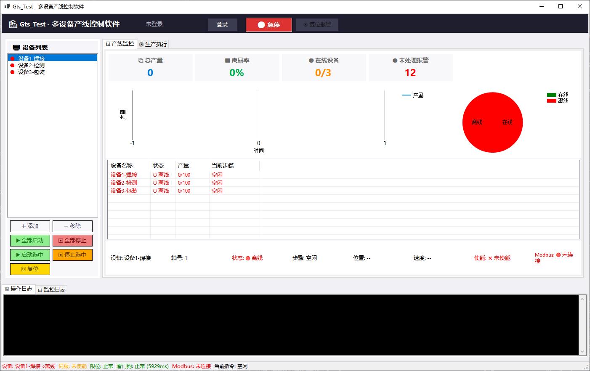

# 🚀 GtsTest 运动控制卡调试平台

基于 .NET 8.0 WinForms 开发的高性能运动控制测试工具，专为 **固高 GTS 系列运动控制卡** 设计。  
采用 **MVP 架构** 与 **命令模式**，实现了硬件无关的模拟器支持与动态 JSON 工作流编排。

---

## 📷 程序效果预览

> 使用双图并排展示，点击可查看大图：

<p align="center">
  
  
</p>
<p align="center">
  <em>左侧：主操作界面（轴控/监控/模式切换） &nbsp;|&nbsp; 右侧：工作流执行与日志输出</em>
</p>

---

## ✨ 核心功能

| 功能模块 | 说明 |
| :--- | :--- |
| **设备初始化** | 打开控制卡并复位，建立通信连接 |
| **关闭设备** | 安全释放硬件资源，断开与控制卡的连接 |
| **实时监控** | 独立后台线程高频轮询轴位置、速度、加速度，数据实时刷新 |
| **轴状态查询** | 一键获取轴状态码、运动模式、限位/报警信息 |
| **模拟/真实切换** | 通过静态开关一键切换，无需重启程序即可在模拟环境和真实硬件间无缝切换 |
| **JSON 工作流** | 支持通过配置文件动态编排运动指令（回零、定位、等待 IO、延时），无需修改代码即可调整流程 |
| **双日志系统** | 操作日志与实时监控日志分栏显示，后端按类别（Operation/Monitor）自动落盘 |
| **日志文件归档** | 按日期和类别自动生成日志文件（如 `OperationLog_2026-08-02.txt`），便于追溯 |

---

## ⚙️ 技术架构

| 技术维度 | 实现方案 |
| :--- | :--- |
| **架构模式** | **MVP（Model-View-Presenter）** 与 **被动视图（Passive View）** 变体。UI（Form1）不依赖任何业务逻辑，完全通过事件与 Presenter（GtsController）通信；Presenter 负责从 Model（GtsModel）获取数据并主动渲染 UI，实现视图与逻辑的完美解耦。 |
| **设计模式** | **命令模式（Command Pattern）**：将每个运动指令（Home / MoveAbs / WaitIO / Delay）封装为独立的命令类，支持任意组合为序列（SequenceCommand），便于扩展和维护。 |
| **多线程并发** | 独立的后台监控线程（`PollingLoop`），采用高精度定时器（补偿 Sleep 误差），不阻塞 UI 渲染；工作流执行同样在后台线程运行，支持取消令牌（`CancellationToken`）实现优雅退出。 |
| **模拟器实现** | 在 `GtsModel` 层完全模拟固高 API 行为，内置正弦波速度数据和自动递增位置，无需硬件即可完整演示所有 UI 交互和流程逻辑。 |
| **硬件接口封装** | `gts.cs` 为固高 SDK 的 P/Invoke 声明（**未包含在仓库中**，需从固高官方 SDK 获取）；`GtsModel` 层统一封装错误处理，屏蔽底层调用细节。 |
| **配置驱动** | 工作流使用 JSON 格式配置，程序启动时自动扫描 `Workflows/` 目录并填充下拉列表，新增流程只需添加 JSON 文件，无需重新编译。 |
| **日志系统** | `FileLogger` 静态类统一处理文件落盘，线程安全（`lock` 同步），支持按类别（Operation / Monitor / General）分类存储。 |

---

## 🛠️ 环境配置与运行

### 1. 获取固高依赖文件（必读）
由于版权限制，本仓库 **不包含** `gts.cs` 和 `gts.dll`。  
请从固高（Googol Technology）官方 SDK 包中获取，并放置于项目根目录：

| 文件 | 说明 |
| :--- | :--- |
| `gts.cs` | C# 接口声明文件（P/Invoke 定义） |
| `gts.dll` | 原生动态链接库（需与 `GtsTest.exe` 同目录，或放置在系统 PATH 中） |

> 官方 SDK 通常包含在固高 GTS 系列控制卡的配套光盘或官网下载中心。

### 2. 运行模式切换
打开 `Program.cs`，修改以下代码：
```csharp
// true = 模拟运行（无需硬件） / false = 连接真实控制卡
GtsModel.UseSimulation = true;
```
### 3. 编译与启动
环境要求：Visual Studio 2022+ 或 .NET 8.0 SDK

编译后运行，点击 “初始化” 按钮建立连接，选择轴号即可开始监控或执行工作流

### 4. 工作流配置
在 Workflows/ 目录下新建 .json 文件，程序启动时会自动扫描并显示在下拉列表中。
```csharp
📄 示例 1：简单往返（SimpleMove.json）
{
  "Name": "简单往返",
  "Description": "走到20000 -> 延时 -> 回到0",
  "Commands": [
    { "Type": "MoveAbs", "Axis": 1, "TargetPos": 20000, "Vel": 30, "Acc": 15 },
    { "Type": "Delay", "DelayMs": 300 },
    { "Type": "MoveAbs", "Axis": 1, "TargetPos": 0, "Vel": 20, "Acc": 10 }
  ]
}

📄 示例 2：标准回零定位流程（StandardFlow.json）
{
  "Name": "标准回零定位流程",
  "Description": "回零 -> 走到10000 -> 等待IO0 -> 走到5000 -> 延时500ms",
  "Commands": [
    { "Type": "Home", "Axis": 1, "HomePos": 0, "Vel": 20, "Acc": 10 },
    { "Type": "MoveAbs", "Axis": 1, "TargetPos": 10000, "Vel": 15, "Acc": 8 },
    { "Type": "WaitIO", "IoIndex": 0, "ExpectValue": true, "TimeoutMs": 3000 },
    { "Type": "MoveAbs", "Axis": 1, "TargetPos": 5000, "Vel": 10, "Acc": 5 },
    { "Type": "Delay", "DelayMs": 500 }
  ]
}

```

📋 支持的指令类型
| 指令类型 | 参数 | 说明 | 
| :--- | :--- |:--- | 
| `Home` | Axis, HomePos, Vel, Acc  | 执行回零，到达 HomePos 位置  |
| `MoveAbs` | Axis, TargetPos, Vel, Acc | 绝对定位到目标位置  |
| `WaitIO` | IoIndex, ExpectValue, TimeoutMs | 等待指定 IO 输入达到期望值（支持超时） |
| `Delay` | DelayMs | 延时等待（毫秒） |


###📁 目录结构
GtsTest/
├── GtsModel.cs              		# 核心数据模型（封装固高 API + 模拟器实现）
├── GtsController.cs         		# 控制器（事件订阅、线程调度、工作流路由）
├── Form1.cs                 		# 主视图（UI 控件与事件暴露）
├── Form1.Designer.cs        		# 视图设计器文件
├── FileLogger.cs            		# 日志落盘工具（线程安全）
├── Commands/                	 	# 命令模式实现
│   ├── IMotionCommand.cs    	# 命令接口
│   ├── MotionCommandBase.cs 	# 命令基类（模板方法）
│   ├── HomeCommand.cs       	# 回零指令
│   ├── MoveAbsCommand.cs    	# 绝对定位指令
│   ├── WaitIOCommand.cs     	# 等待 IO 指令
│   ├── DelayCommand.cs      		# 延时指令
│   ├── SequenceCommand.cs   	# 序列组合指令
│   ├── CommandConfig.cs     		# JSON 配置模型
│   ├── CommandFactory.cs    		# 命令工厂
│   └── WorkflowConfig.cs    		# 工作流配置模型
├── Workflows/               		# JSON 工作流配置文件存放目录
│   ├── SimpleMove.json      		# 示例：简单往返
│   └── StandardFlow.json    		# 示例：标准回零定位流程
├── Images/                  		# 文档用截图（main.png, test.png）
└── Logs/                    		# 运行时日志目录（自动生成）


###🚀 未来规划
1、增加 PVT / 插补运动的高级配置界面
2、完善 JSON 工作流的错误校验与断点续跑功能
3、支持多轴联动轨迹的实时速度倍率调整（Override）

###⚠️ 注意事项
1、真实模式下操作设备请务必注意安全限位，避免机械碰撞。
2、模拟模式数据仅用于 UI 演示和逻辑验证，与实际物理反馈无关。
3、切换模拟/真实模式后，必须重新点击“初始化” 才能生效。
4、工作流 JSON 文件需放置在 Workflows/ 目录下，程序启动时会自动扫描并填充下拉列表。