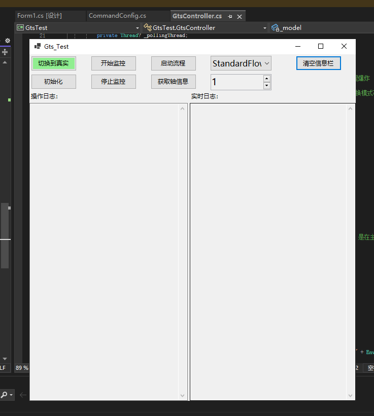
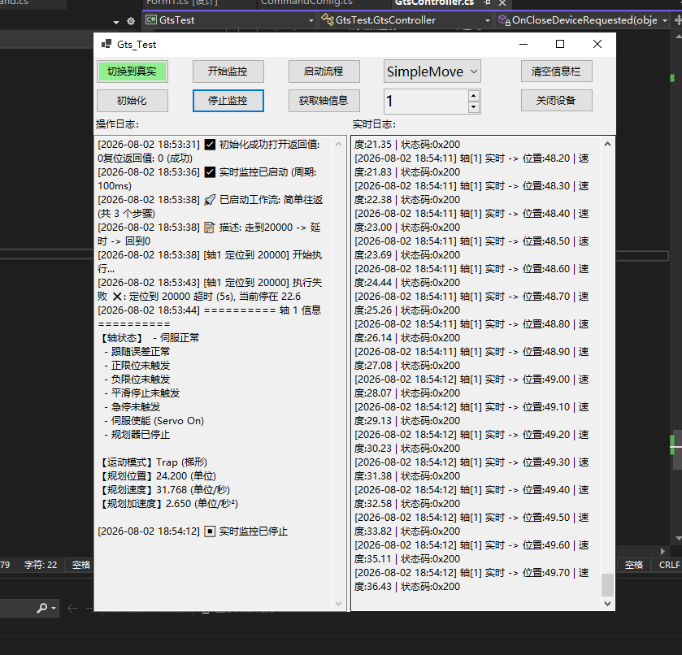

# 🚀 GtsTest 运动控制卡调试平台

基于 .NET 8.0 WinForms 开发的高性能运动控制测试工具，专为 **固高 GTS 系列运动控制卡** 设计。  
采用 **MVP 架构** 与 **命令模式**，实现了硬件无关的模拟器支持与动态 JSON 工作流编排。

---

## 📷 程序效果预览

> 使用双图并排展示，点击可查看大图：

<p align="center">
  
  
</p>
<p align="center">
  <em>左侧：主操作界面（轴控/监控/模式切换） &nbsp;|&nbsp; 右侧：工作流执行与日志输出</em>
</p>

---

## ✨ 核心技术要点

| 技术维度 | 实现方案与亮点 |
| :--- | :--- |
| **架构设计** | **MVP（Model-View-Presenter）** 模式，UI 完全解耦，事件驱动通信。 |
| **模拟/真实切换** | 通过 `GtsModel.UseSimulation` 静态开关，**一键切换**；模拟模式内置正弦波速度数据，无需硬件即可演示。 |
| **多线程并发** | 独立的后台监控线程（`PollingLoop`），高精度定时器（补偿 Sleep 误差），不阻塞 UI 渲染。 |
| **工作流引擎** | 基于 **命令模式（Command Pattern）** 实现；支持 `SequenceCommand` 组合，任意嵌套。 |
| **动态流程配置** | 支持 **JSON 配置文件**（存放于 `Workflows/` 目录），动态生成指令链（Home / MoveAbs / WaitIO / Delay）。 |
| **双日志系统** | 界面分离：`操作日志` 与 `实时监控日志` 分栏显示；后端通过 `FileLogger` 按类别（Operation/Monitor）自动落盘。 |
| **硬件接口封装** | `gts.cs` 为固高 SDK 的 P/Invoke 声明（**未包含在仓库中**）；`GtsModel` 层统一封装错误处理。 |
| **异常容错** | 线程取消令牌（`CancellationToken`）超时机制；界面关闭时自动释放硬件资源。 |

---

## ⚙️ 环境配置与运行

### 1. 获取固高依赖文件（必读）
由于版权限制，本仓库 **不包含** `gts.cs` 和 `gts.dll`。  
请从固高（Googol Tech）官方 SDK 包中获取，并放置于项目根目录：

- `gts.cs` → C# 接口声明文件
- `gts.dll` → 原生动态链接库（需与 `GtsTest.exe` 同目录）

### 2. 运行模式切换
打开 `Program.cs`，修改以下代码：
```csharp
// true = 模拟运行（无需硬件） / false = 连接真实控制卡
GtsModel.UseSimulation = true;

###3. 编译与启动
环境：Visual Studio 2022+ 或 .NET 8.0 SDK

点击“初始化”按钮建立连接，选择轴号即可开始监控或执行工作流。

 📁 目录结构说明
GtsTest/
├── GtsModel.cs          	# 核心数据模型（封装 API + 模拟器）
├── GtsController.cs     	# 控制器（事件订阅、线程调度、工作流路由）
├── Form1.cs             	# 主视图（UI 控件与事件暴露）
├── Commands/            	# 指令实现（Home, MoveAbs, WaitIO, Delay, Sequence）
├── Workflows/           	# 放置 .json 工作流配置文件（自动生成）
├── Images/              	# 文档用截图（mian.png, test.png）
└── Logs/                	# 运行时日志（自动生成）


 📝 待扩展方向
**增加 PVT / 插补运动支持
**完善 JSON 指令校验与错误回滚
**导入 G 代码或 DXF 文件路径规划