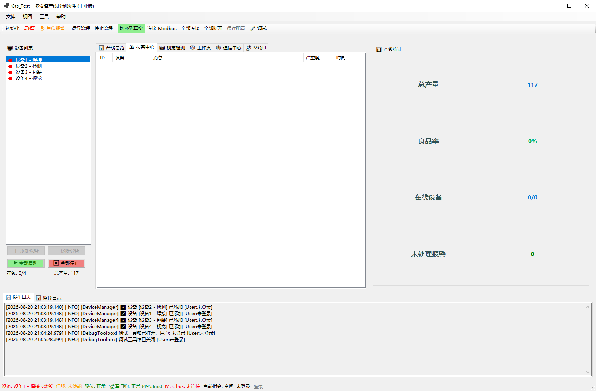
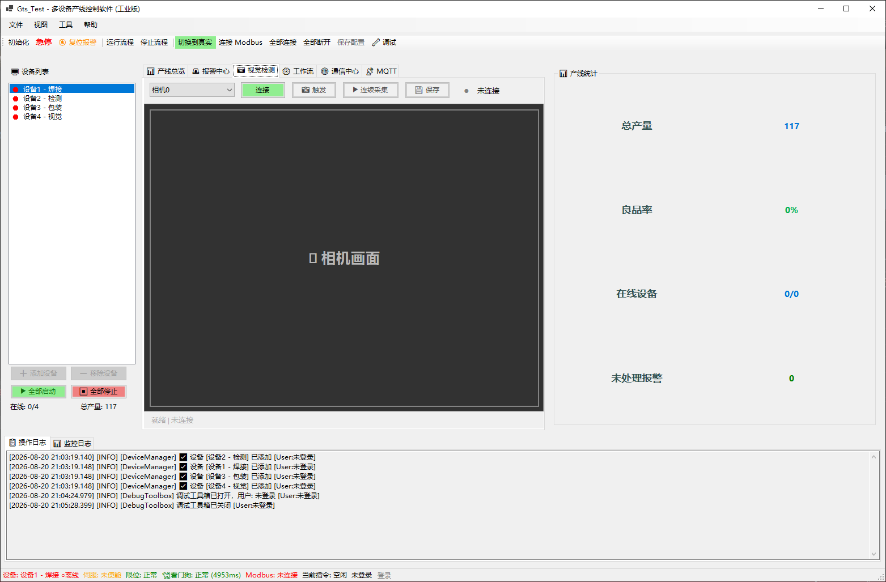
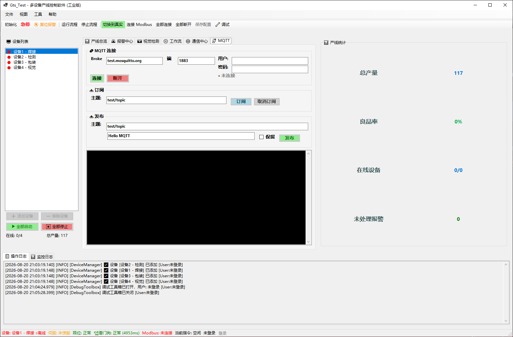
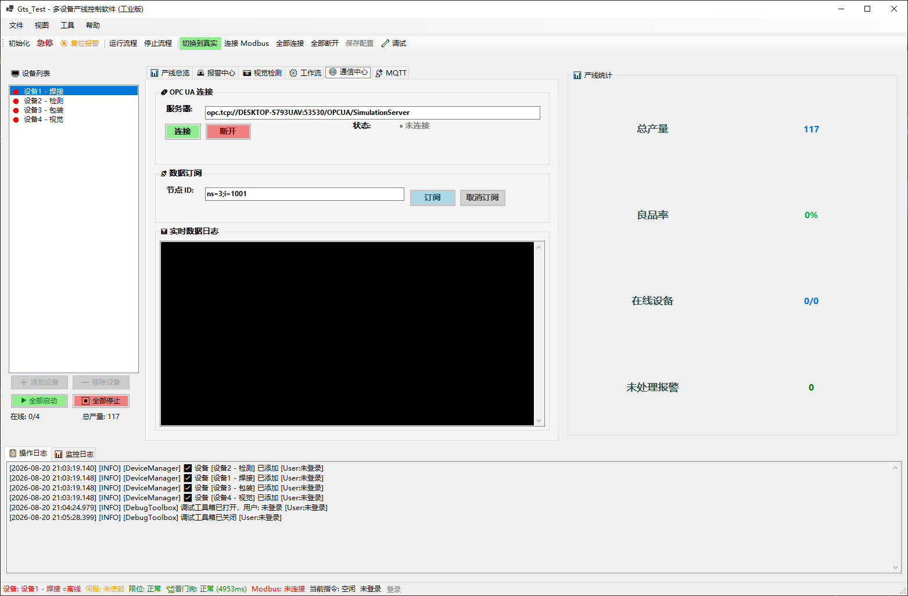
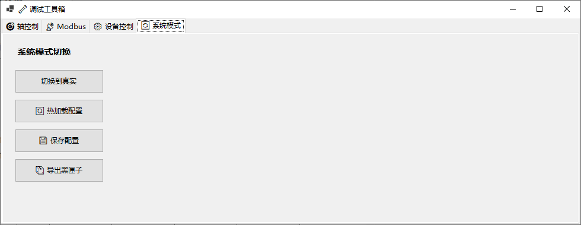

# GTS 产线控制系统

[](https://dotnet.microsoft.com/)
[](LICENSE)
[]()
[]()

基于 **.NET 8.0 WinForms** 的多设备并行控制与监控平台，专为 **固高 GTS 系列运动控制卡** 设计。  
集成 Modbus TCP/RTU、OPC UA、MQTT 通信、工作流编排、报警管理、用户权限审计及黑匣子日志，适用于产线自动化与测试台架。

---

## 📋 目录

- [界面预览](#-界面预览)
- [功能特性](#-功能特性)
- [技术架构](#-技术架构)
- [快速开始](#-快速开始)
- [工作流配置](#-工作流配置)
- [数据库设计](#-数据库设计)
- [项目结构](#-项目结构)
- [权限管理](#-权限管理)
- [待开发功能](#-待开发功能)
- [贡献指南](#-贡献指南)
- [许可证](#-许可证)

---

## 🖼️ 界面预览

### 主界面与登录

| 主操作界面 | 登录界面 |
|:---:|:---:|
|  |  |

### 设备与通信配置

| 添加设备配置 | Modbus 高级配置 |
|:---:|:---:|
|  |  |

### 核心功能模块

| 报警中心 | 视觉检测 |
|:---:|:---:|
|  |  |

| 工作流编辑 | MQTT 通信 |
|:---:|:---:|
|  |  |

| OPC UA 通信 |
|:---:|
|  |

### 调试工具箱

| 轴控制 | Modbus 调试 |
|:---:|:---:|
|  |  |

| 设备控制 | 系统模式 |
|:---:|:---:|
|  |  |

---

## 🚀 功能特性

| 模块 | 描述 | 状态 |
|------|------|------|
| **多设备管理** | 动态增删设备，每台独立配置（IP、端口、轴号、目标产量），在线/离线状态指示灯 | ✅ 已完成 |
| **运动控制** | 回零、绝对定位、点动（Jog+ / Jog-）、伺服使能/去使能、急停、软限位、报警复位 | ✅ 已完成 |
| **Modbus 通信** | TCP/RTU 协议，读写线圈/寄存器/离散输入，支持 Int16/32、Float、Double 及大/小端字节序 | ✅ 已完成 |
| **OPC UA 客户端** | 连接 OPC UA 服务器，读写节点值，订阅数据变化，支持浏览节点树 | ✅ 已完成 |
| **MQTT 客户端** | 连接 Broker，订阅/发布主题，支持保留消息和 QoS | ✅ 已完成 |
| **工作流引擎** | JSON 配置顺序命令（Home、MoveAbs、WaitIO、Delay），动态加载，多设备复用 | ✅ 已完成 |
| **相机视觉** | 连接相机、触发拍照、连续采集、图像保存（支持模拟/真实相机） | ✅ 已完成 |
| **实时监控** | 后台多线程高频轮询轴位置/速度/加速度及 Modbus 数据，趋势图实时更新 | ✅ 已完成 |
| **黑匣子缓冲区** | 内存循环存储最近 30000 条监控记录，一键导出为文本文件 | ✅ 已完成 |
| **双日志系统** | 操作日志与监控日志分栏显示，按日期/大小滚动落盘，自动清理过期文件 | ✅ 已完成 |
| **报警管理** | 触发、确认、解决报警，按严重等级分类，SQLite 持久化 | ✅ 已完成 |
| **用户权限与审计** | 基于角色（Admin/Engineer/Operator）的访问控制，关键操作记录审计日志 | ✅ 已完成 |
| **模拟/真实切换** | 无需硬件即可在模拟模式下完整运行，一键切换时自动检测固高卡 | ✅ 已完成 |
| **设备看门狗** | 每台设备独立看门狗，监控 Modbus 通信健康状态，超时自动重连或报警 | ✅ 已完成 |
| **配置导入导出** | 设备配置可导出为 `devices.json` 文件，支持导入恢复 | ✅ 已完成 |
| **调试工具箱** | 独立调试窗体，支持轴控、Modbus 读写、设备启停、模式切换、黑匣子导出 | ✅ 已完成 |

---

## 🏗️ 技术架构

| 方面 | 实现 |
|------|------|
| **架构模式** | MVP（Model‑View‑Presenter）+ 被动视图 |
| **设计模式** | 命令模式（Command Pattern）、模板方法、观察者、工厂模式 |
| **多线程** | 独立后台轮询线程 + `CancellationToken` 工作流取消 |
| **模拟器** | `GtsModel` 层完全模拟固高 API，支持无硬件测试 |
| **硬件抽象** | `gts.cs` P/Invoke（需从固高 SDK 获取） |
| **配置驱动** | `devices.json` + `Workflows/*.json` |
| **Modbus 集成** | [NModbus](https://github.com/NModbus/NModbus) 库 |
| **OPC UA 集成** | [OPC Foundation .NET Standard](https://github.com/OPCFoundation/UA-.NETStandard) |
| **MQTT 集成** | [MQTTnet](https://github.com/dotnet/MQTTnet) |
| **视觉处理** | [Emgu.CV](https://github.com/emgucv/emgucv)（OpenCV .NET 封装） |
| **循环缓冲区** | `ConcurrentQueue` 线程安全 |
| **日志系统** | `AppLogger` 静态类，基于 `System.Threading.Channels`，异步写入，滚动清理 |
| **数据持久化** | SQLite（异步写入） |
| **看门狗** | 独立监控任务 |
| **密码哈希** | PBKDF2-SHA256（RFC 2898） |

### 架构分层示意

```
┌─────────────────────────────────────────────────────────────────────┐
│                          UI 层 (WinForms)                          │
│   Form1 / OverviewControl / CameraControl / WorkflowControl        │
│   CommunicationControl / MqttControl / DebugToolboxForm           │
└─────────────────────────────────────────────────────────────────────┘
                                    │
                                    ▼
┌─────────────────────────────────────────────────────────────────────┐
│                       Presenter 层 (MVP)                           │
│          GtsPresenter / CameraPresenter / MqttPresenter            │
└─────────────────────────────────────────────────────────────────────┘
                                    │
                                    ▼
┌─────────────────────────────────────────────────────────────────────┐
│                      Service / Model 层                            │
│   DeviceManager / GtsModel / ModbusClient / OpcUaClient           │
│   MqttService / AlarmManager / AuthenticationService              │
│   Watchdog / AppLogger / CyclicMonitorBuffer                      │
└─────────────────────────────────────────────────────────────────────┘
                                    │
                                    ▼
┌─────────────────────────────────────────────────────────────────────┐
│                        基础设施层                                  │
│   SQLite / gts.dll / NModbus / Emgu.CV / MQTTnet / OPC UA SDK    │
└─────────────────────────────────────────────────────────────────────┘
```

---

## 📦 快速开始

### 1. 获取固高 SDK（必须）

本仓库 **不包含** `gts.cs` 和 `gts.dll`（版权限制）。  
请从固高（Googol Technology）官网或配套光盘获取：

| 文件 | 位置 |
|------|------|
| `gts.cs` | 项目源代码根目录（与 `GtsModel.cs` 同级） |
| `gts.dll` | 编译输出目录或系统 PATH |

> 仅模拟模式可省略 `gts.dll`，但 `gts.cs` 仍需存在。

### 2. 环境要求

- Windows 10/11（x86/x64）
- [.NET 8 SDK](https://dotnet.microsoft.com/download/dotnet/8.0)
- Visual Studio 2022 或 VS Code

### 3. 克隆与编译

```bash
git clone https://github.com/.../gts-production-line.git
cd gts-production-line
dotnet restore
dotnet build -c Release
dotnet run --project GtsTest.csproj
```
默认以 **模拟模式** 启动，无需硬件。

### 4. 首次登录

- 程序启动后自动创建 SQLite 数据库（`gts.db`）
- 默认管理员账号 `admin` 会在首次启动时自动生成，初始密码输出到日志中
- 建议登录后立即修改密码

---

## ⚙️ 工作流配置

工作流使用 **JSON** 格式定义，存放在 `Workflows/` 目录下。程序启动时会自动扫描该目录，将每个 `.json` 文件作为一个独立的工作流选项显示在界面的下拉列表中。

### 文件结构

```json
{
  "Name": "工作流名称",
  "Description": "工作流描述（可选）",
  "Commands": [
    { "Type": "命令类型", "参数1": "值1", "参数2": "值2" },
    { "Type": "命令类型", "参数1": "值1", "参数2": "值2" }
  ]
}
```
### 完整示例：焊接工作流

```json
{
  "Name": "焊接流程",
  "Description": "标准焊接工序：回零 → 定位 → 等待IO → 延时",
  "Commands": [
    {
      "Type": "Home",
      "Axis": 1,
      "HomePos": 0
    },
    {
      "Type": "MoveAbs",
      "Axis": 1,
      "TargetPos": 10000,
      "Vel": 20.0,
      "Acc": 10.0
    },
    {
      "Type": "WaitIO",
      "IoIndex": 0,
      "ExpectValue": true
    },
    {
      "Type": "Delay",
      "DelayMs": 500
    }
  ]
}
```

### 命令类型详解

| 命令类型 | 参数 | 类型 | 说明 |
|----------|------|------|------|
| **Home** | `Axis` | int | 轴号（1~8） |
| | `HomePos` | int | 回零目标位置（脉冲数），默认 0 |
| **MoveAbs** | `Axis` | int | 轴号（1~8） |
| | `TargetPos` | int | 目标位置（脉冲数） |
| | `Vel` | double | 运行速度，默认 10.0 |
| | `Acc` | double | 加速度，默认 5.0 |
| **WaitIO** | `IoIndex` | int | IO 索引号（从 0 开始） |
| | `ExpectValue` | bool | 期望值（true/false），超时 5 秒 |
| **Delay** | `DelayMs` | int | 延时毫秒数 |

### 多设备复用

`Axis` 参数是**占位符**。当工作流在某个设备上执行时，系统会自动将 `Axis` 替换为该设备配置的轴号。  
因此，同一个工作流文件可以应用于不同设备，无需为每台设备单独编写。

> 💡 设备1配置轴号为1，设备2配置轴号为2，同一个 `Home` 命令在设备1上执行轴1回零，在设备2上执行轴2回零。

### 添加新工作流

1. 在 `Workflows/` 目录下创建 `*.json` 文件
2. 按照上述格式编写命令序列
3. 重启程序或点击“运行流程”下拉列表即可看到新选项

> 程序启动时会自动扫描并缓存所有工作流文件，无需重新编译。

---

## 🗄️ 数据库设计

系统使用 **SQLite** 作为本地嵌入式数据库，文件名为 `gts.db`（自动创建于程序运行目录）。

### 表结构

#### 1. Users（用户表）

| 字段 | 类型 | 说明 |
|------|------|------|
| Id | INTEGER | 主键，自增 |
| Username | TEXT UNIQUE | 登录用户名 |
| PasswordHash | TEXT | PBKDF2-SHA256 哈希密码（含 salt 和 iterations） |
| Salt | TEXT | 密码盐值（兼容旧格式，新格式已内嵌） |
| FullName | TEXT | 用户全名 |
| Role | TEXT | 角色：Admin / Engineer / Operator |
| IsActive | INTEGER | 是否启用（0=禁用，1=启用） |
| CreatedTime | TEXT | 创建时间（ISO 8601） |
| FailedAttempts | INTEGER | 连续失败登录次数 |
| LockoutUntil | TEXT | 锁定到期时间（ISO 8601） |

#### 2. AuditLogs（审计日志表）

| 字段 | 类型 | 说明 |
|------|------|------|
| Id | INTEGER | 主键，自增 |
| UserId | INTEGER | 操作用户 ID |
| Username | TEXT | 操作用户名 |
| ActionType | TEXT | 操作类型（如 Login、StartAllDevices、SaveConfig） |
| Detail | TEXT | 操作详情 |
| Timestamp | TEXT | 操作时间（ISO 8601） |

#### 3. ProductionRecords（生产记录表）

| 字段 | 类型 | 说明 |
|------|------|------|
| Id | INTEGER | 主键，自增 |
| DeviceId | TEXT | 设备 ID |
| Timestamp | TEXT | 记录时间（ISO 8601） |
| CurrentCount | INTEGER | 当前产量 |
| TargetCount | INTEGER | 目标产量 |

#### 4. AlarmRecords（报警记录表）

| 字段 | 类型 | 说明 |
|------|------|------|
| Id | INTEGER | 主键，自增 |
| DeviceId | TEXT | 关联设备 ID |
| Message | TEXT | 报警消息 |
| Severity | TEXT | 严重等级（Info/Warning/Error/Critical） |
| Timestamp | TEXT | 触发时间（ISO 8601） |
| IsAcknowledged | INTEGER | 是否已确认 |
| IsResolved | INTEGER | 是否已解决 |
| AcknowledgedBy | TEXT | 确认人 |
| ResolvedBy | TEXT | 解决人 |
| AcknowledgedTime | TEXT | 确认时间 |
| ResolvedTime | TEXT | 解决时间 |


## 📁 项目结构

```text
GtsTest/                              # 📦 仓库根目录
├── .gitignore                        # Git 忽略规则配置
├── GtsTest.sln                       # Visual Studio 解决方案文件
├── README.md                         # 项目文档（本文件）
├── LICENSE                           # MIT 开源许可证
│
├── Images/                           # 🖼️ 界面截图（供 README 渲染使用）
│   ├── main.png                      # 主操作界面截图
│   ├── login.png                     # 登录界面截图
│   ├── AlarmManager.png              # 报警中心截图
│   ├── CameraControl.png             # 视觉检测模块截图
│   ├── DebugAxis.png                 # 调试工具箱 - 轴控制截图
│   ├── DebugCtlDevice.png            # 调试工具箱 - 设备控制截图
│   ├── DebugInfo.png                 # 调试工具箱 - 系统模式截图
│   ├── DebugModbus.png               # 调试工具箱 - Modbus 调试截图
│   ├── DeviceSte.png                 # 添加设备配置向导截图
│   ├── ModbusSte.png                 # Modbus 高级配置截图
│   ├── MqttControl.png               # MQTT 通信模块截图
│   ├── OpcUa.png                     # OPC UA 通信模块截图
│   └── Workflow.png                  # 工作流编辑界面截图
│
└── GtsTest/                          # 📁 项目源码根目录
    ├── GtsTest.csproj                # .NET 项目文件（依赖配置）
    ├── Program.cs                    # 🚀 应用程序入口点
    │
    ├── Core/                         # ⚙️ 核心基础设施
    │   ├── AppLogger.cs              # 全局异步日志系统（基于 Channel，支持文件滚动）
    │   ├── CyclicMonitorBuffer.cs    # 黑匣子缓冲区（内存循环存储，最近 30000 条）
    │   ├── DeviceManager.cs          # 设备管理器（多设备并行控制与数据采集）
    │   ├── GtsModel.cs               # 固高运动控制卡模型（封装 gts.dll，含模拟模式）
    │   ├── Watchdog.cs               # 工业级看门狗（监控 Modbus 通信健康）
    │   └── gts.cs                    # ⚠️ 固高 SDK P/Invoke 声明（需自行获取）
    │
    ├── Commands/                     # 🎯 工作流命令（命令模式实现）
    │   ├── IMotionCommand.cs         # 运动命令接口
    │   ├── MotionCommandBase.cs      # 命令基类（模板方法，含日志和异常处理）
    │   ├── CommandConfig.cs          # 命令配置 DTO（序列化/反序列化用）
    │   ├── CommandFactory.cs         # 命令工厂（根据配置类型创建命令实例）
    │   ├── HomeCommand.cs            # 回零命令（轴回零并等待完成）
    │   ├── MoveAbsCommand.cs         # 绝对定位命令（运动到目标位置）
    │   ├── WaitIOCommand.cs          # 等待 IO 命令（轮询 DI 状态，支持超时）
    │   ├── DelayCommand.cs           # 延时命令（等待指定毫秒数）
    │   ├── SequenceCommand.cs        # 序列命令（组合模式，顺序执行子命令）
    │   └── WorkflowConfig.cs         # 工作流配置 DTO（包含命令列表）
    │
    ├── Controls/                     # 🖥️ UI 用户控件（View 层）
    │   ├── CameraControl.cs          # 相机控件（实现 ICameraView，支持触发/连续采集）
    │   ├── CommunicationControl.cs   # OPC UA 通信控件（连接/订阅/数据展示）
    │   ├── MqttControl.cs            # MQTT 控件（实现 IMqttView，连接/订阅/发布）
    │   ├── OverviewControl.cs        # 产线总览控件（设备卡片 + 产量趋势图）
    │   └── WorkflowControl.cs        # 工作流编辑控件（步骤列表/增删改/保存加载）
    │
    ├── Forms/                        # 📄 WinForms 窗体
    │   ├── Form1.cs                  # 主窗体（实现 IGtsView，集成所有功能模块）
    │   ├── Form1.Designer.cs         # 主窗体设计器文件
    │   ├── LoginForm.cs              # 登录窗体（用户身份验证）
    │   ├── LoginForm.Designer.cs     # 登录窗体设计器
    │   ├── DeviceConfigForm.cs       # 设备配置向导（添加/编辑设备参数）
    │   ├── DeviceConfigForm.Designer.cs
    │   ├── ModbusConfigForm.cs       # Modbus 高级配置窗体
    │   ├── ModbusConfigForm.Designer.cs
    │   ├── DebugToolboxForm.cs       # 调试工具箱（轴控/Modbus/设备控制/系统模式）
    │   └── DebugToolboxForm.Designer.cs
    │
    ├── Modbus/                       # 📡 Modbus 通信模块
    │   ├── ModbusClient.cs           # Modbus 客户端（基于 NModbus，支持 TCP/RTU）
    │   ├── ModbusConfig.cs           # Modbus 配置 DTO（协议/地址/数据类型/字节序）
    │   ├── ModbusConnectionEventArgs.cs # Modbus 连接状态事件参数
    │   └── ModbusFormatter.cs        # Modbus 数据格式化工具（支持多种显示格式）
    │
    ├── Presenters/                   # 🎭 MVP 表现层
    │   ├── IGtsView.cs               # 主视图接口（定义 UI 与 Presenter 的契约）
    │   ├── GtsPresenter.cs           # 主 Presenter（业务逻辑编排，订阅视图事件）
    │   ├── ICameraView.cs            # 相机视图接口
    │   ├── CameraPresenter.cs        # 相机 Presenter（连接/触发/采集）
    │   ├── IMqttView.cs              # MQTT 视图接口
    │   └── MqttPresenter.cs          # MQTT Presenter（连接/订阅/发布）
    │
    ├── Services/                     # 🔧 服务层（业务逻辑与外部依赖）
    │   ├── Alarm/                    # 🚨 报警管理
    │   │   ├── IAlarmManager.cs      # 报警管理接口
    │   │   └── AlarmManager.cs       # 报警管理器实现（SQLite 持久化）
    │   ├── Authentication/           # 🔐 认证与授权
    │   │   ├── IAuthenticationService.cs # 认证服务接口
    │   │   ├── AuthenticationService.cs   # 认证服务实现（PBKDF2 密码哈希）
    │   │   ├── AuthenticationHelper.cs    # PBKDF2 哈希工具（RFC 2898）
    │   │   └── SessionManager.cs          # 用户会话管理（静态单例）
    │   ├── Camera/                   # 📷 相机服务
    │   │   ├── ICameraService.cs     # 相机服务接口
    │   │   ├── RealCameraService.cs  # 真实相机服务（基于 Emgu.CV）
    │   │   └── SimulatedCameraService.cs # 模拟相机服务（无硬件测试）
    │   ├── Data/                     # 💾 数据持久化
    │   │   ├── IDataRepository.cs    # 数据仓储接口
    │   │   ├── SqliteRepository.cs   # SQLite 仓储实现（用户 CRUD）
    │   │   ├── AuditService.cs       # 审计日志服务（异步写入 SQLite）
    │   │   ├── AlarmRecord.cs        # 报警记录模型
    │   │   └── ProductionService.cs  # 产量记录服务（异步写入 SQLite）
    │   ├── Logging/                  # 📝 日志包装
    │   │   ├── ILogger.cs            # 日志接口
    │   │   └── AppLoggerWrapper.cs   # AppLogger 适配器（实现 ILogger）
    │   ├── OpcUa/                    # 🔌 OPC UA 客户端
    │   │   └── OpcUaClient.cs        # OPC UA 客户端（基于 OPC Foundation SDK）
    │   ├── IMqttService.cs           # MQTT 服务接口（连接/订阅/发布）
    │   ├── MqttService.cs            # MQTT 服务实现（基于 MQTTnet）
    │   ├── IMqttPublisher.cs         # MQTT 发布器接口（待扩展）
    │   └── IRecipeManager.cs         # 配方管理接口（待实现）
    │
    └── Models/                       # 📊 数据模型
        ├── DeviceConfig.cs           # 设备配置模型（IP/端口/轴号/目标产量）
        ├── DeviceRuntime.cs          # 设备运行时状态（连接/看门狗/当前步骤）
        └── User.cs                   # 用户模型（用户名/角色/密码哈希）
```
> 📌 **运行时生成目录说明**：
>
> | 目录 | 位置 | 说明 |
> |------|------|------|
> | `bin/` | 编译输出目录 | 包含编译后的 DLL/EXE，由 .NET 生成 |
> | `bin/Workflows/` | `bin/` 下 | 工作流 JSON 配置文件，**程序启动时自动加载**，用户可在此添加自定义工作流 |
> | `Logs/` | 程序运行目录 | 日志文件按日期滚动，由 `AppLogger` 自动生成 |
> | `gts.db` | 程序运行目录 | SQLite 数据库，首次启动时自动创建 |
> | `devices.json` | 程序运行目录 | 设备配置文件，启动时加载，保存时导出 |


## 🔐 权限管理

| 角色 | 权限 |
|------|------|
| **未登录** | 大部分操作禁用 |
| **Admin** | 全部权限 |
| **Engineer** | 启动/停止设备、编辑配置（不能删除设备） |
| **Operator** | 仅启动/停止设备 |

所有关键操作写入审计日志（`AuditLogs` 表）。

### 权限检查示例（代码层面）

```csharp
// 在 Presenter 中检查权限
if (!CheckPermission("Config.Edit")) return;
```
### 📡 通信协议支持
| 协议 | 状态 | 说明 |
|------|------|------|
| **Modbus TCP** | ✅ 完成 | NModbus 实现，支持读写线圈/寄存器 |
| **Modbus RTU** | ✅ 完成 | NModbus.Serial 实现，支持串口通信 |
| **OPC UA** | ✅ 完成 | OPC Foundation 官方 SDK，支持浏览/读写/订阅 |
| **MQTT** | ✅ 完成 | MQTTnet 实现，支持连接/订阅/发布 |

### OPC UA 使用示例

```csharp
// 连接服务器
await opcClient.ConnectAsync("opc.tcp://localhost:4840");

// 订阅节点
opcClient.Subscribe("ns=3;i=1001");

// 读取节点值
var value = await opcClient.ReadNodeValueAsync<double>("ns=3;i=1001");
```
### 🧪 调试工具箱

程序内置 **调试工具箱**（`DebugToolboxForm`），提供以下功能：

- **轴控制**：回零、定位、点动、伺服使能/去使能、急停、报警复位
- **Modbus 测试**：读写寄存器/线圈，支持多种数据类型和字节序
- **设备控制**：启动/停止设备、Modbus 配置
- **系统模式**：模拟/真实切换、热加载配置、保存配置
- **黑匣子导出**：一键导出内存缓冲区日志

> 💡 仅管理员和工程师角色可访问调试工具箱。

---

## 📝 配置文件说明

| 文件/目录 | 位置 | 用途 |
|-----------|------|------|
| `devices.json` | 程序运行目录 | 设备配置，启动时自动加载，不存在则创建默认三台设备 |
| `Workflows/*.json` | `bin/` 目录下 | 工作流定义，**程序启动时自动扫描加载**，用户可自行添加 JSON 文件 |
| `gts.db` | 程序运行目录 | SQLite 数据库（自动创建） |
| `Logs/` | 程序运行目录 | 日志目录，按日期滚动，自动清理 |

---

## 🔧 待开发功能

以下功能模块的**接口已定义**，但**具体实现尚未完成**，欢迎贡献代码：

| 功能 | 接口/类 | 优先级 | 说明 |
|------|---------|--------|------|
| **MQTT 发布器（扩展）** | `IMqttPublisher` | 中 | 将设备状态、报警、生产数据通过 MQTT 协议推送至云端 |
| **配方管理** | `IRecipeManager` | 低 | 配方的新建、编辑、保存、加载及版本管理 |
| **报警 UI 确认/解决按钮** | `Form1` 事件绑定 | 中 | 已在 Presenter 中订阅，需添加 UI 按钮 |
| **Modbus 读取循环** | `DeviceManager.DeviceLoop` | 低 | 重构为可配置的读取策略（定时/触发/变化检测） |
| **工作流命令扩展** | `Commands/` | 低 | `SetDO`（写数字量）、`WaitModbus`（等待寄存器条件）、`Loop` |
| **生产统计报表** | `Services/ReportService` | 低 | 按日/周/月生成产量报表，导出 Excel/PDF |
| **远程诊断** | `Services/RemoteDiagnostic` | 低 | 通过 TCP/WebSocket 实现远程日志查看 |

---

## 🤝 贡献指南

欢迎提交 Issue 和 Pull Request！

### 新增命令类型

1. 在 `Commands/` 目录下创建新类，实现 `IMotionCommand` 接口
2. 继承 `MotionCommandBase` 并实现 `ExecuteCore` 方法
3. 在 `CommandFactory.cs` 的 `Create` 方法中注册新命令类型
4. 在 `CommandConfigDialog` 中添加对应的 UI 配置项

### 代码规范

- 遵循 C# 编码规范（[Microsoft 官方指南](https://learn.microsoft.com/dotnet/csharp/fundamentals/coding-style/coding-conventions)）
- 使用 `AppLogger` 记录关键操作
- 所有公共 API 需包含 XML 文档注释

---

## 📄 许可证

[MIT](LICENSE)

---

## 📧 联系方式

如有问题，请在 [GitHub Issues]) 中提出。

---

**Made with ❤️ for industrial automation**
