# GTS 产线控制系统

[](https://dotnet.microsoft.com/)
[](LICENSE)
[]()
[]()

基于 **.NET 8.0 WinForms** 的多设备并行控制与监控平台，专为 **固高 GTS 系列运动控制卡** 设计。

集成 Modbus TCP/RTU、OPC UA、MQTT、**Siemens S7 PLC**、**RS232/485 串口** 通信，**MES 双协议上报（REST + SOAP）**，工作流编排、报警管理、用户权限审计及黑匣子日志，适用于产线自动化与测试台架。

---

## 📋 目录

- [界面预览](#-界面预览)
- [功能特性](#-功能特性)
- [技术架构](#-技术架构)
- [快速开始](#-快速开始)
- [工作流配置](#-工作流配置)
- [数据库设计](#-数据库设计)
- [项目结构](#-项目结构)
- [权限管理](#-权限管理)
- [通信协议](#-通信协议)
- [系统配置中心](#-系统配置中心)
- [配置文件说明](#-配置文件说明)
- [MES 上报服务](#-mes-上报服务)
- [Modbus 协议详解](#-modbus-协议详解)
- [扩展点](#-扩展点)
- [测试报告摘要](#-测试报告摘要)
- [待开发功能](#-待开发功能)
- [贡献指南](#-贡献指南)
- [许可证](#-许可证)

---

## 🖼️ 界面预览

### 主界面与登录

| 主操作界面 | 登录界面 |
|:---:|:---:|
| 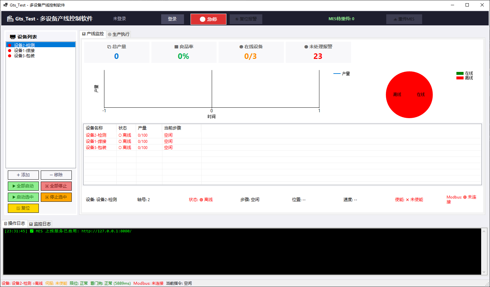 | 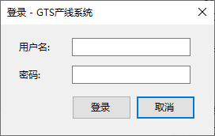 |
| 顶部标题栏、设备列表、产线监控/生产执行选项卡、操作日志/监控日志、状态栏 | 用户名/密码输入框，登录/取消按钮 |

**主界面说明：**

- **顶部栏**：标题、用户信息、登录/登出按钮、急停按钮、一键确认并解决所有活动报警按钮、系统管理按钮、MES 待重传数量、**MES 手动重传按钮**、**重载配置按钮**
- **左侧设备列表**：显示所有设备及在线状态（绿色/红色指示灯），支持添加/移除设备
- **中间区域**：
  - **产线监控** 选项卡：4 张统计卡片（总产量/良品率/在线设备/未处理报警）、产量趋势折线图、在线/离线饼图、设备列表、底部设备详情栏
  - **生产执行** 选项卡：设备选择、工作流选择、绑定/执行/停止/复位/产量清零按钮、步骤列表、执行状态、执行日志
- **底部日志**：操作日志（黑色背景绿色文字）和监控日志（黑色背景青色文字）分栏显示
- **底部状态栏**：显示当前设备名称、伺服状态、限位状态、看门狗状态、Modbus 状态、当前指令

### 设备配置

| 添加设备配置 | Modbus 高级配置 |
|:---:|:---:|
| 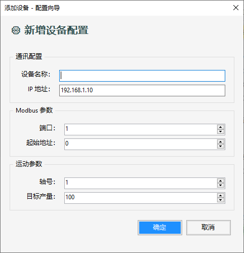 | 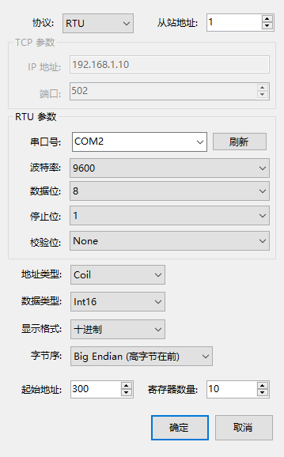 |
| 设备名称、IP 地址、Modbus 端口、起始地址、轴号、目标产量 | 协议选择(TCP/RTU)、从站地址、TCP 参数、RTU 参数、地址类型、数据类型、显示格式、字节序、起始地址、寄存器数量 |

**设备配置说明：**

- 添加设备时需配置通讯参数（IP/端口）、Modbus 参数（起始地址/寄存器数量）和运动参数（轴号/目标产量）
- Modbus 高级配置支持 TCP 和 RTU 两种协议：
  - **TCP 参数**：IP 地址、端口
  - **RTU 参数**：串口号、波特率、数据位、停止位、校验位
  - **地址类型**：Coil / HoldingRegister / InputRegister / DiscreteInput
  - **数据类型**：Int16 / UInt16 / Int32 / UInt32 / Float / Double
  - **字节序**：BigEndian / LittleEndian

### 核心功能模块

| 工作流编辑（主界面） | 工作流编辑（系统配置中心） |
|:---:|:---:|
| 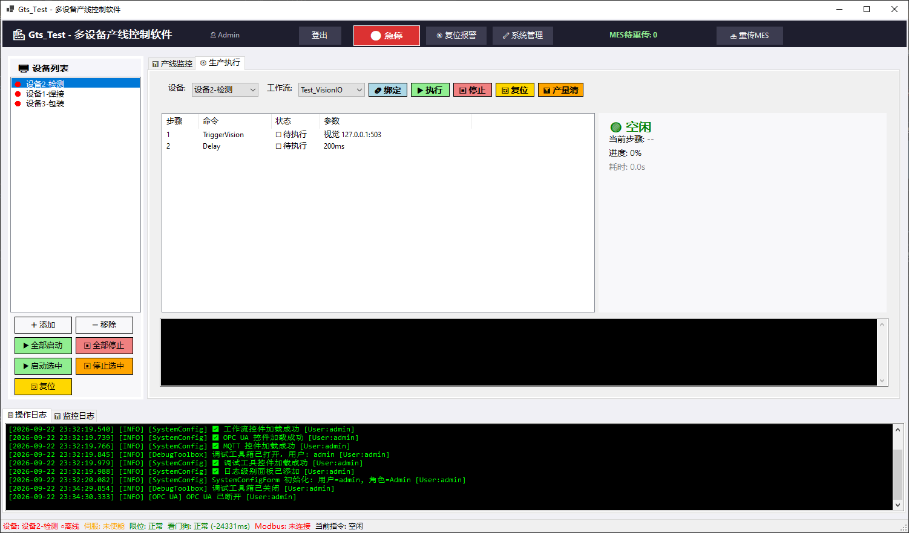 | 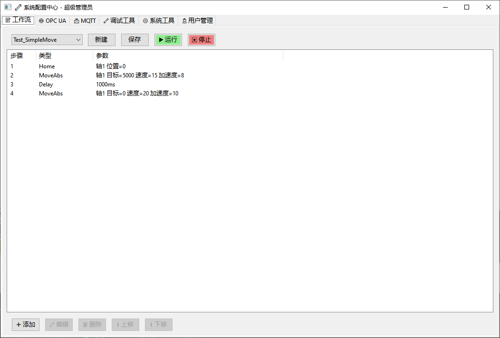 |
| 主界面生产执行选项卡：工作流下拉选择、步骤列表、执行状态 | 系统配置中心工作流编辑器：新建/保存/运行/停止、步骤增删改/上移下移 |

| MQTT 通信 | OPC UA 通信 |
|:---:|:---:|
| 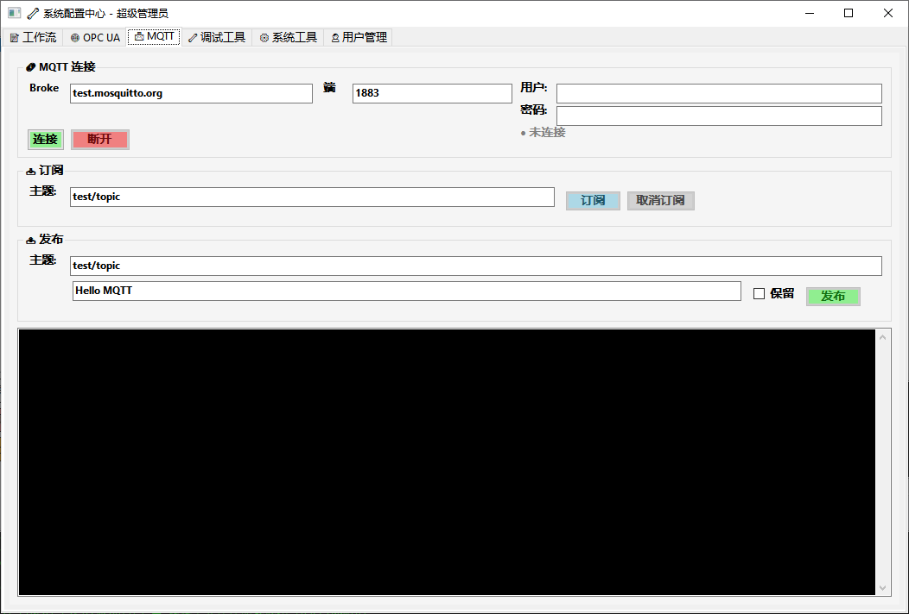 | 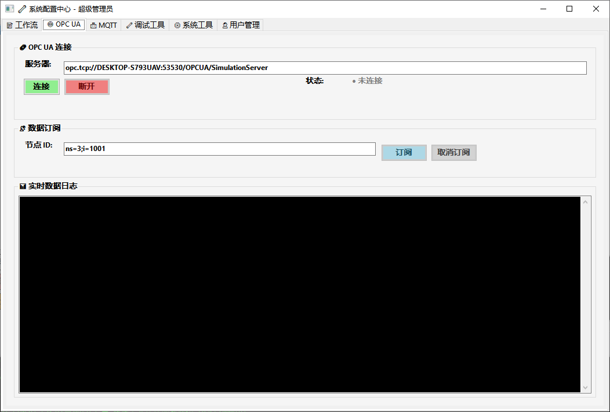 |
| Broker 地址/端口/用户名/密码、连接/断开、主题订阅/取消订阅、消息发布 | 服务器地址输入、连接/断开、节点 ID 订阅/取消订阅、实时数据日志显示 |

| 系统工具 | 用户管理 |
|:---:|:---:|
| 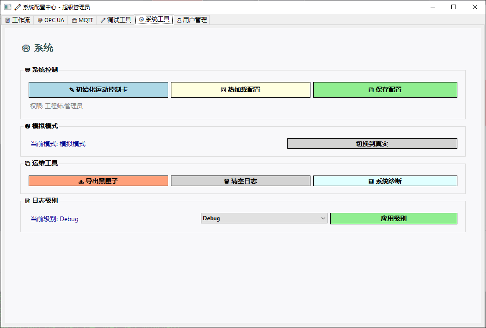 | 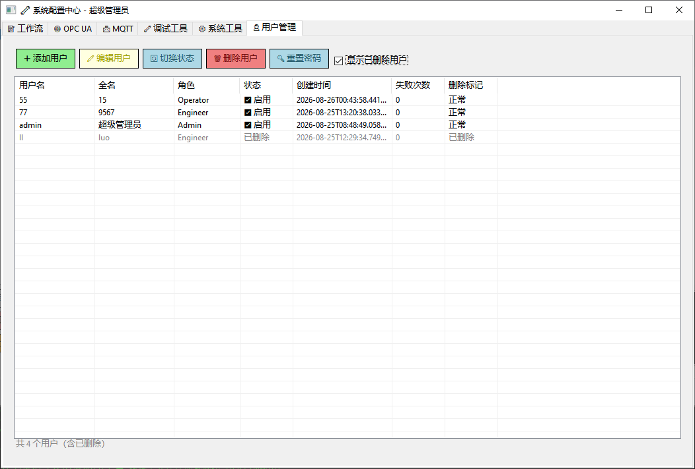 |
| 系统控制（初始化运动控制卡/热加载配置/保存配置）、模拟模式切换、运维工具、日志级别实时切换 | 用户列表、添加/编辑/切换状态/删除/重置密码、显示已删除用户复选框 |

### 调试工具箱

调试工具箱是独立的调试窗体，**通过系统配置中心 → 调试工具 选项卡打开**，包含 **六个** 选项卡：

| 轴控制 | Modbus 调试 |
|:---:|:---:|
| 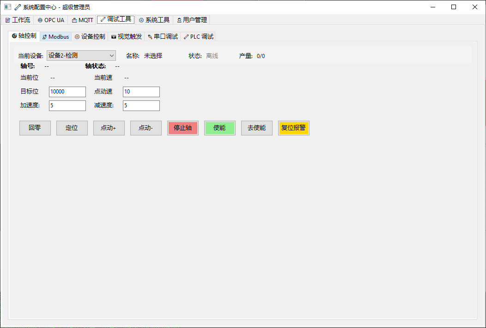 | 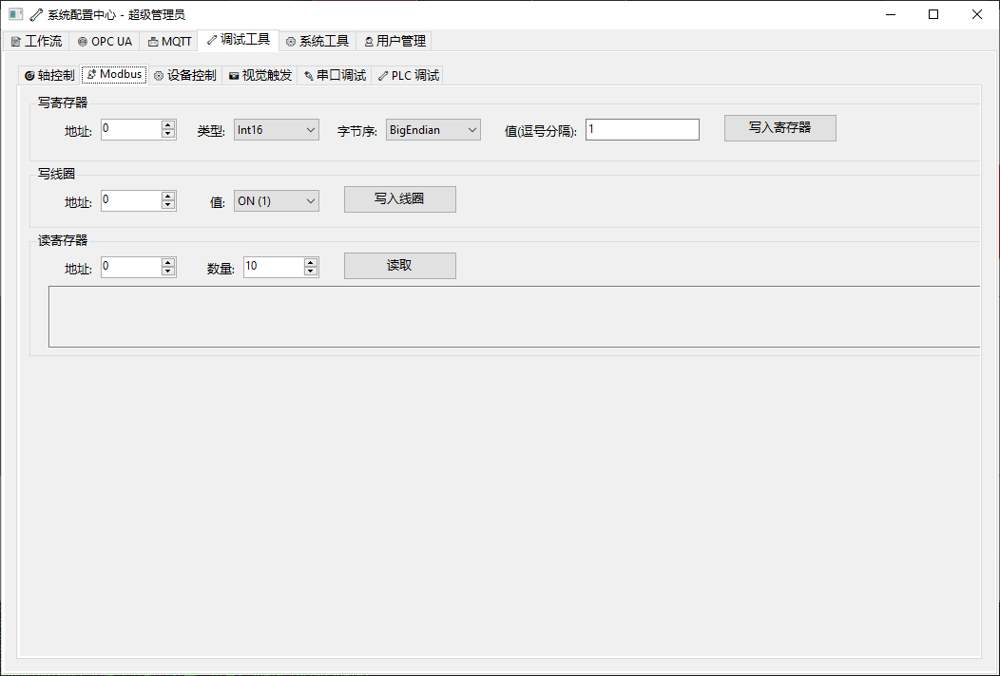 |
| 设备选择、轴号/轴状态/当前位置/当前速度显示、回零/定位/点动+/点动-/停止轴/使能/去使能/复位报警按钮 | 写寄存器（地址/类型/字节序/值）、写线圈（地址/ON/OFF）、读寄存器（地址/数量/结果显示） |

| 设备控制 | 视觉触发调试 |
|:---:|:---:|
| 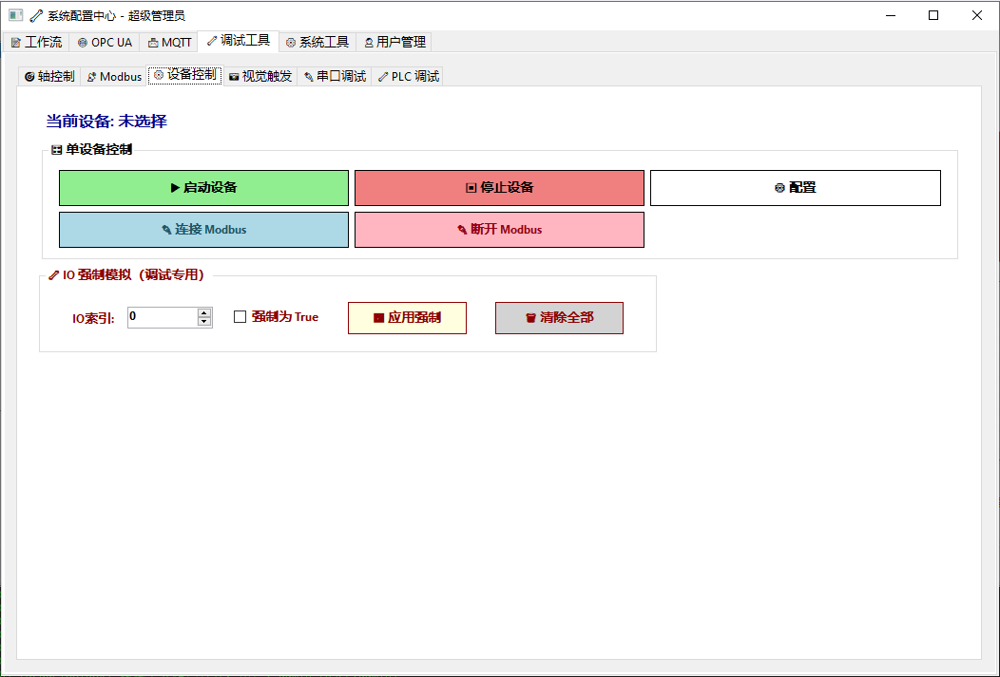 | 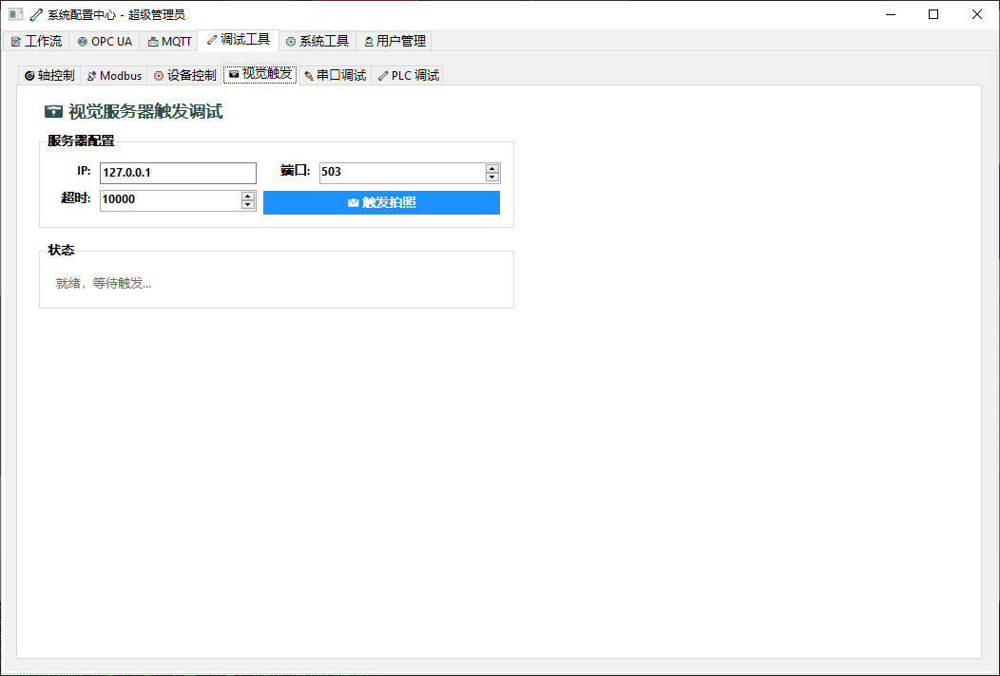 |
| 单设备控制（启动设备/停止设备/配置）、Modbus 连接/断开 | 视觉服务器配置（IP/端口/超时）、触发拍照按钮、状态显示 |

| 串口调试 ⭐ 新增 | PLC 调试 ⭐ 新增 |
|:---:|:---:|
| 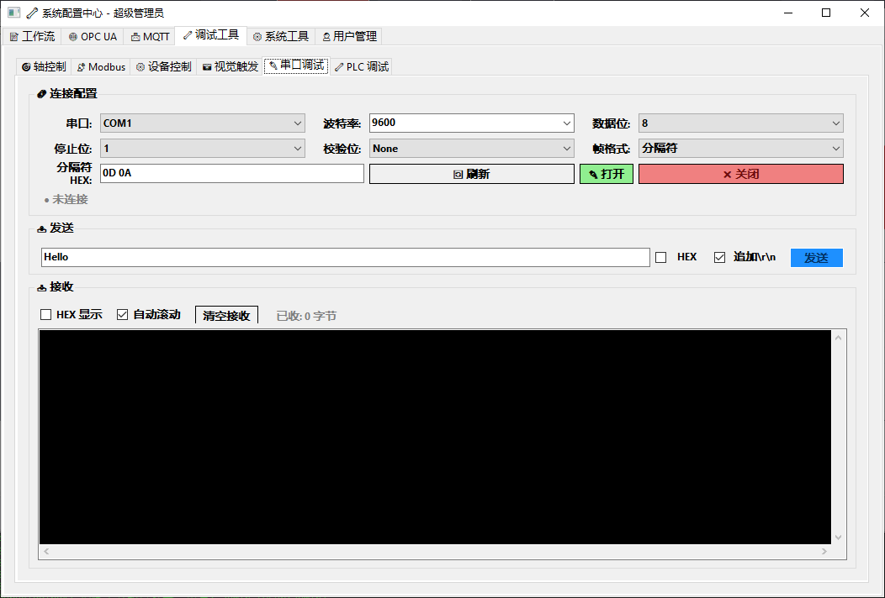 |  |
| 串口配置、HEX/ASCII 发送、帧格式（原始流/定长/头+长度/分隔符）、实时接收 | PLC 类型（模拟/西门子 S7-1200/1500/300/400/200Smart）、IP/Rack/Slot 配置、寄存器读写 |

---

## 🚀 功能特性

| 模块 | 描述 | 状态 |
|------|------|------|
| **多设备管理** | 动态增删设备，每台独立配置（IP、端口、轴号、目标产量），在线/离线状态指示灯 | ✅ |
| **运动控制** | 回零、绝对定位、点动（Jog+ / Jog-）、伺服使能/去使能、急停、软限位、报警复位 | ✅ |
| **Modbus 通信** | TCP/RTU 协议，读写线圈/寄存器/离散输入，支持 Int16/32、Float、Double 及大/小端字节序 | ✅ |
| **OPC UA 客户端** | 连接 OPC UA 服务器，读写节点值，订阅数据变化，支持浏览节点树 | ✅ |
| **MQTT 客户端** | 连接 Broker，订阅/发布主题，支持保留消息和 QoS | ✅ |
| **Siemens S7 PLC 驱动** ⭐ | 基于 S7NetPlus，支持 S7-1200/1500/300/400/200Smart，Bool/Short/Int/UInt/Float/Double/String/Bytes 读写，自动重连 | ✅ |
| **RS232/485 串口驱动** ⭐ | 4 种帧格式（原始流/定长/头+长度/分隔符），自动重连，事件+轮询双通道读取 | ✅ |
| **工作流引擎** | JSON 配置顺序命令（Home、MoveAbs、WaitIO、Delay、TriggerVision、WriteSignal、WaitSignal），动态加载，多设备复用 | ✅ |
| **视觉触发命令** | 通过 Modbus 触发视觉服务器拍照，自动等待结果并解析状态码 | ✅ |
| **跨设备信号交互** | 在工作流中读写其他设备的 Modbus 线圈，实现设备间联锁 | ✅ |
| **设备-工作流绑定** | 设备可预先绑定工作流，支持"全部启动"一键运行各设备配方 | ✅ |
| **实时监控** | 后台多线程高频轮询轴位置/速度/加速度及 Modbus 数据，趋势图实时更新 | ✅ |
| **黑匣子缓冲区** | 内存循环存储最近 30000 条监控记录，一键导出为文本文件 | ✅ |
| **双日志系统** | 操作日志与监控日志分栏显示，按日期/大小滚动落盘，自动清理过期文件 | ✅ |
| **报警管理** | 触发、确认、解决报警，按严重等级分类，SQLite 持久化（后端已完成，UI 待添加） | ⏳ |
| **用户权限与审计** | 基于角色（Admin/Engineer/Operator）的访问控制，关键操作记录审计日志，支持逻辑删除/恢复用户 | ✅ |
| **产量记录服务** | 异步记录产量更新到 SQLite，为报表统计提供数据基础 | ✅ |
| **模拟/真实切换** | 无需硬件即可在模拟模式下完整运行，一键切换时自动检测固高卡 | ✅ |
| **设备看门狗** | 每台设备独立看门狗，监控 Modbus 通信健康状态，超时自动重连或报警 | ✅ |
| **配置导入导出** | 设备配置可导出为 `devices.json` 文件，支持导入恢复 | ✅ |
| **调试工具箱** | 独立调试窗体，支持轴控、Modbus 读写、设备启停、系统模式切换、视觉触发调试、串口调试、PLC 调试 | ✅ |
| **EF Core 多数据库** ⭐ | SQLite / SQL Server / MySQL 三数据库一键切换，无需改代码 | ✅ |
| **MES 双协议上报** ⭐ | REST + SOAP 双协议，通过 `mes_config.json` 切换，异步队列 + 离线缓存 + 分级重传 | ✅ |
| **MES 健康监控** ⭐ | 独立看门狗每 10 秒探测 MES 端点，离线时暂停重传，恢复时自动重传 | ✅ |
| **配置热重载** ⭐ | 运行时重载 devices.json / mes_config.json / appsettings.json，无需重启程序 | ✅ |
| **日志级别动态切换** ⭐ | 通过 UI 下拉框或配置文件实时切换日志级别（Trace/Debug/Info/Warn/Error/Fatal） | ✅ |

---

## 🏗️ 技术架构

### 技术栈

| 方面 | 实现 |
|------|------|
| **架构模式** | MVP（Model-View-Presenter）+ 被动视图 |
| **设计模式** | 命令模式、模板方法、观察者、工厂模式、策略模式 |
| **多线程** | 独立后台轮询线程 + `CancellationToken` 工作流取消 |
| **模拟器** | `GtsModel` 层完全模拟固高 API，支持无硬件测试 |
| **硬件抽象** | `gts.cs` P/Invoke（需从固高 SDK 获取） |
| **配置驱动** | `devices.json` + `Workflows/*.json` + `mes_config.json` + `appsettings.json` |
| **ORM 框架** ⭐ | Entity Framework Core 8.0（多数据库支持） |
| **Modbus 集成** | [NModbus](https://github.com/NModbus/NModbus) |
| **OPC UA 集成** | [OPC Foundation .NET Standard](https://github.com/OPCFoundation/UA-.NETStandard) |
| **MQTT 集成** | [MQTTnet](https://github.com/dotnet/MQTTnet) |
| **PLC 集成** ⭐ | [S7NetPlus](https://github.com/S7NetPlus/s7netplus) |
| **循环缓冲区** | `ConcurrentQueue` 线程安全 |
| **日志系统** | `AppLogger` 静态类，基于 `System.Threading.Channels`，异步写入，滚动清理 |
| **数据持久化** | SQLite / SQL Server / MySQL（EF Core） |
| **看门狗** | 独立监控任务 + MES 健康监控 |
| **密码哈希** | PBKDF2-SHA256（RFC 2898） |
| **异步队列** ⭐ | `System.Threading.Channels` |
| **SOAP 客户端** ⭐ | 基于 `HttpClient` 手写 SOAP 1.1/1.2 Envelope（不依赖 WCF） |

### 分层架构示意

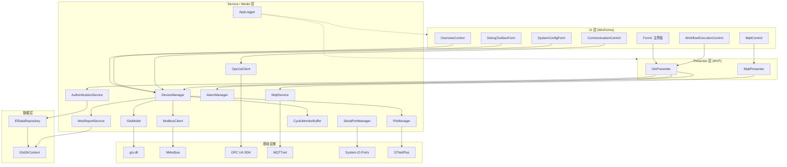
```mermaid
graph TD
    subgraph UI["UI 层 (WinForms)"]
        F1[Form1 主界面]
        OE[OverviewControl]
        WE[WorkflowExecutionControl]
        CC[CommunicationControl]
        MC[MqttControl]
        DT[DebugToolboxForm]
        SC[SystemConfigForm]
    end

    subgraph PRESENTER["Presenter 层 (MVP)"]
        GP[GtsPresenter]
        MP[MqttPresenter]
    end

    subgraph SERVICE["Service / Model 层"]
        DM[DeviceManager]
        GM[GtsModel]
        MD[ModbusClient]
        OP[OpcUaClient]
        MQ[MqttService]
        PL[PlcManager]
        SR[SerialPortManager]
        MES[MesReportService]
        AM[AlarmManager]
        AU[AuthenticationService]
        LG[AppLogger]
        CB[CyclicMonitorBuffer]
    end

    subgraph DATA["数据层"]
        EF[EfDataRepository]
        DB[GtsDbContext]
    end

    subgraph INFRA["基础设施"]
        GT[gts.dll]
        NM[NModbus]
        UAS[OPC UA SDK]
        MT[MQTTnet]
        SP[System.IO.Ports]
        S7[S7NetPlus]
    end

    F1 --> GP
    OE --> DM
    WE --> GP
    CC --> OP
    MC --> MP
    DT --> DM
    SC --> DM

    GP --> DM
    GP --> AM
    GP --> AU
    MP --> MQ

    DM --> GM
    DM --> MD
    DM --> PL
    DM --> MES
    DM --> CB

    MD --> NM
    GM --> GT
    OP --> UAS
    MQ --> MT
    PL --> S7
    SR --> SP

    AU --> EF
    EF --> DB
    MES --> DB

    LG -.-> UI
    LG -.-> PRESENTER
    LG -.-> SERVICE
```

### 模块职责

| 模块 | 位置 | 职责 |
|------|------|------|
| **GtsPresenter** | `Presenters/` | MVP 核心调度，桥接 UI 与 Service |
| **DeviceManager** | `Core/` | 多设备并行调度、工作流循环、MES 触发 |
| **GtsModel** | `Core/` | 固高 GTS SDK 的封装，支持模拟/真实切换 |
| **Watchdog** | `Core/` | 通信健康监控看门狗 |
| **AppLogger** | `Core/` | 基于 Channel 的异步日志系统 |
| **CyclicMonitorBuffer** | `Core/` | 30000 条循环内存缓冲区（黑匣子） |
| **ModbusClient** | `Modbus/` | Modbus TCP/RTU 客户端 |
| **OpcUaClient** | `Services/OpcUa/` | OPC UA 客户端（连接/读写/订阅） |
| **MqttService** | `Services/` | MQTT 客户端 |
| **PlcManager** | `Services/Plc/` | 多 PLC 管理 + 西门子 S7 驱动 |
| **SerialPortManager** | `Services/Serial/` | 多串口管理 + 4 种帧格式解析 |
| **MesReportService** | `Services/Mes/` | MES 双协议上报 + 异步队列 + 离线缓存 |
| **MesHealthMonitor** | `Services/Mes/` | MES 端点健康监控 |
| **EfDataRepository** | `Data/` | EF Core 多数据库仓储 |
| **DbContextFactory** | `Data/` | 数据库工厂，支持 SQLite/SqlServer/MySQL |

### 关键设计模式

#### 命令模式（Command Pattern）

工作流中的每个步骤是一个 `IMotionCommand` 实现：

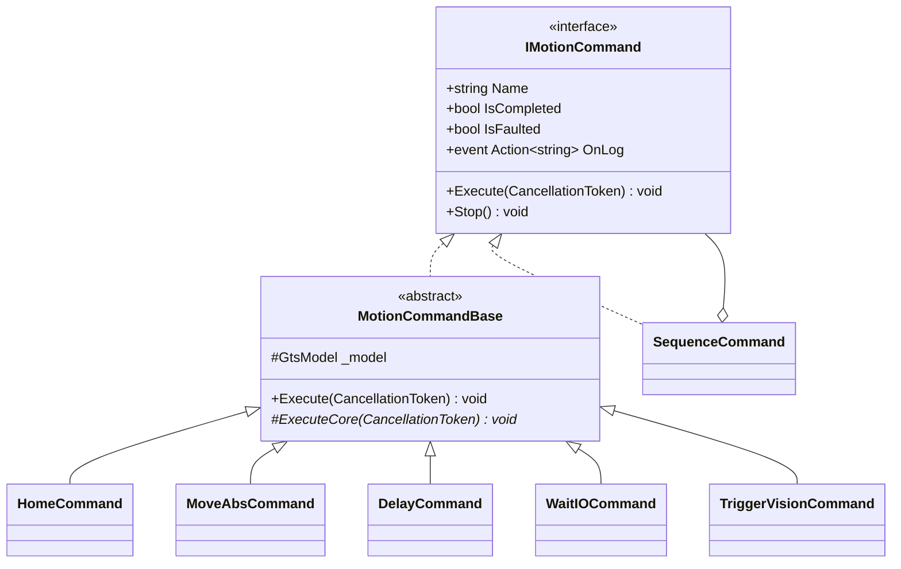
```mermaid
classDiagram
    class IMotionCommand {
        <<interface>>
        +string Name
        +bool IsCompleted
        +bool IsFaulted
        +event Action~string~ OnLog
        +Execute(CancellationToken) void
        +Stop() void
    }
    class MotionCommandBase {
        <<abstract>>
        #GtsModel _model
        +Execute(CancellationToken) void
        #ExecuteCore(CancellationToken)* void
    }
    class HomeCommand
    class MoveAbsCommand
    class DelayCommand
    class WaitIOCommand
    class TriggerVisionCommand
    class SequenceCommand

    IMotionCommand <|.. MotionCommandBase
    MotionCommandBase <|-- HomeCommand
    MotionCommandBase <|-- MoveAbsCommand
    MotionCommandBase <|-- DelayCommand
    MotionCommandBase <|-- WaitIOCommand
    MotionCommandBase <|-- TriggerVisionCommand
    IMotionCommand <|.. SequenceCommand
    SequenceCommand o-- IMotionCommand
```

#### 策略模式（Strategy Pattern）

- `ISerialFrameParser` → `FixedLengthParser` / `LengthFieldParser` / `DelimiterParser`
- `IPlcClient` → `SiemensS7Client` / `SimulatedPlcClient`
- `IDataRepository` → `EfDataRepository`（新）/ `SqliteRepository`（旧）

### 线程模型

| 线程 | 职责 | 生命周期 |
|------|------|----------|
| **UI 线程** | 界面渲染、用户交互 | 程序全程 |
| **设备循环线程** | 每台设备一个 `Task.Run` 执行工作流 | `StartDevice` → `StopDevice` |
| **看门狗线程** | 每台设备独立，检查通信健康 | 工作流运行期间 |
| **GrabLoop 线程** | 相机采集循环 | 相机连接期间 |
| **日志写线程** | `Channel` 消费 + 文件写入 | `Initialize` → `Shutdown` |
| **MES 消费线程** | `Channel` 消费 + 上报 | `MesReportService` 生命周期 |
| **MES 重传线程** | 定期重传待上报数据 | `MesReportService` 生命周期 |
| **MES 健康监控线程** | 每 10 秒探测 MES 端点 | `MesHealthMonitor` 生命周期 |
| **串口读取线程** | 事件 + 20ms 轮询双通道 | `SerialPortDriver.Open()` 期间 |
| **PLC 自动重连线程** | 连接失败时定时重试 | `SiemensS7Client` 生命周期 |

---

## 📦 快速开始

### 1. 获取固高 SDK（必须）

本仓库 **不包含** `gts.cs` 和 `gts.dll`（版权限制）。请从固高（Googol Technology）官网或配套光盘获取：

| 文件 | 位置 |
|------|------|
| `gts.cs` | 项目源代码根目录（与 `GtsModel.cs` 同级） |
| `gts.dll` | 编译输出目录或系统 PATH |

> 仅模拟模式可省略 `gts.dll`，但 `gts.cs` 仍需存在。

### 2. 环境要求

- Windows 10/11（x86/x64）
- [.NET 8 SDK](https://dotnet.microsoft.com/download/dotnet/8.0)
- Visual Studio 2022 或 VS Code
- **可选**：SQL Server Express / LocalDB 或 MySQL/MariaDB（默认 SQLite 开箱即用）

### 3. 克隆与编译

```bash
git clone https://github.com/your-repo/gts-production-line.git
cd gts-production-line
dotnet restore
dotnet build -c Release
dotnet run --project GtsTest.csproj
```

默认以 **模拟模式** 启动，无需硬件。

### 4. 首次登录

- 程序启动后自动创建 SQLite 数据库（`gts.db`）
- 默认管理员账号 `admin` 会在首次启动时自动生成，初始密码输出到日志中（同时显示在消息框）
- 建议登录后立即修改密码

---

## ⚙️ 工作流配置

工作流使用 **JSON** 格式定义，存放在程序运行目录下的 `Workflows/` 文件夹中。程序启动时会自动扫描该目录，将每个 `.json` 文件作为一个独立的工作流选项显示在界面的下拉列表中。

### 文件结构

```json
{
  "Name": "工作流名称",
  "Description": "工作流描述（可选）",
  "Commands": [
    { "Type": "命令类型", "参数1": "值1", "参数2": "值2" }
  ]
}
```

### 完整示例

```json
{
  "Name": "焊接与视觉检测",
  "Description": "回零 → 定位 → 触发视觉 → 等待结果 → 延时",
  "Commands": [
    { "Type": "Home", "Axis": 1, "HomePos": 0 },
    { "Type": "MoveAbs", "Axis": 1, "TargetPos": 10000, "Vel": 20.0, "Acc": 10.0 },
    { "Type": "WriteSignal", "TargetDevice": "dev-002", "SignalAddress": 100, "SignalValue": true },
    { "Type": "WaitSignal", "TargetDevice": "dev-002", "SignalAddress": 101, "ExpectValue": true },
    { "Type": "TriggerVision", "VisionServerIp": "192.168.1.100", "VisionServerPort": 503 },
    { "Type": "Delay", "DelayMs": 500 }
  ]
}
```

### 命令类型详解

| 命令类型 | 参数 | 说明 |
|----------|------|------|
| **Home** | `Axis` (int) – 轴号（1~8）<br>`HomePos` (int) – 回零目标位置，默认 0 | 启动回零并等待完成（超时 10s） |
| **MoveAbs** | `Axis` (int) – 轴号<br>`TargetPos` (int) – 目标位置（脉冲数）<br>`Vel` (double) – 速度，默认 10.0<br>`Acc` (double) – 加速度，默认 5.0 | 绝对定位并等待到位（超时 5s） |
| **WaitIO** | `IoIndex` (int) – IO 索引号（从 0 开始）<br>`ExpectValue` (bool) – 期望值 | 等待指定 DI 状态（超时 5s） |
| **Delay** | `DelayMs` (int) – 延时毫秒数 | 简单延时 |
| **WriteSignal** | `TargetDevice` (string) – 目标设备 ID<br>`SignalAddress` (int) – 线圈地址<br>`SignalValue` (bool) – 写入值 | 向目标设备的线圈写入值 |
| **WaitSignal** | `TargetDevice` (string) – 目标设备 ID<br>`SignalAddress` (int) – 线圈地址<br>`ExpectValue` (bool) – 期望值 | 等待目标设备线圈达到期望值（超时 10s） |
| **TriggerVision** | `VisionServerIp` (string) – 视觉服务器 IP<br>`VisionServerPort` (int) – 端口，默认 503<br>`TriggerCoilAddress` (int) – 触发线圈，默认 100<br>`BusyCoilAddress` (int) – 忙状态线圈，默认 101<br>`ResultCoilAddress` (int) – 结果线圈，默认 102<br>`ResultCodeRegister` (int) – 结果码寄存器，默认 1000<br>`VisionTimeoutMs` (int) – 超时毫秒，默认 10000 | 触发视觉拍照，等待完成，解析结果码（0 表示成功） |

> ⚠️ **注意**：`WriteSignal` 和 `WaitSignal` 命令中的 `TargetDevice` 参数应使用设备的 `DeviceId`（GUID 字符串），可在 `devices.json` 文件中查看，而非设备显示名称。

### 多设备复用

`Axis` 参数是**占位符**。当工作流在某个设备上执行时，系统会自动将 `Axis` 替换为该设备配置的轴号。因此，同一个工作流文件可以应用于不同设备，无需为每台设备单独编写。

---

## 🗄️ 数据库设计

系统支持 **SQLite / SQL Server / MySQL** 三种数据库，通过 `appsettings.json` 配置切换。默认使用 SQLite（文件 `gts.db`，自动创建于程序运行目录）。

### 表结构

#### 1. Users（用户表）

| 字段 | 类型 | 说明 |
|------|------|------|
| Id | INTEGER | 主键，自增 |
| Username | TEXT UNIQUE | 登录用户名 |
| PasswordHash | TEXT | PBKDF2-SHA256 哈希密码 |
| Salt | TEXT | 密码盐值（兼容旧格式） |
| FullName | TEXT | 用户全名 |
| Role | TEXT | 角色：Admin / Engineer / Operator |
| IsActive | INTEGER | 是否启用 |
| CreatedTime | TEXT | 创建时间（ISO 8601） |
| FailedAttempts | INTEGER | 连续失败登录次数 |
| LockoutUntil | TEXT | 锁定到期时间 |
| IsDeleted | INTEGER | 逻辑删除标记 |
| DeletedTime | TEXT | 删除时间 |
| DeletedBy | TEXT | 删除操作人 |

#### 2. AuditLogs（审计日志表）

| 字段 | 类型 | 说明 |
|------|------|------|
| Id | INTEGER | 主键，自增 |
| UserId | INTEGER | 操作用户 ID |
| Username | TEXT | 操作用户名 |
| ActionType | TEXT | 操作类型 |
| Detail | TEXT | 操作详情 |
| Timestamp | TEXT | 操作时间 |

#### 3. ProductionRecords（生产记录表）

| 字段 | 类型 | 说明 |
|------|------|------|
| Id | INTEGER | 主键，自增 |
| DeviceId | TEXT | 设备 ID |
| Timestamp | TEXT | 记录时间 |
| CurrentCount | INTEGER | 当前产量 |
| TargetCount | INTEGER | 目标产量 |

#### 4. AlarmRecords（报警记录表）

| 字段 | 类型 | 说明 |
|------|------|------|
| Id | INTEGER | 主键，自增 |
| DeviceId | TEXT | 关联设备 ID |
| Message | TEXT | 报警消息 |
| Severity | TEXT | 严重等级 |
| Timestamp | TEXT | 触发时间 |
| IsAcknowledged | INTEGER | 是否已确认 |
| IsResolved | INTEGER | 是否已解决 |
| AcknowledgedBy | TEXT | 确认人 |
| ResolvedBy | TEXT | 解决人 |
| AcknowledgedTime | TEXT | 确认时间 |
| ResolvedTime | TEXT | 解决时间 |

#### 5. MesPendingRecords（MES 待重传表）⭐

| 字段 | 类型 | 说明 |
|------|------|------|
| Id | INTEGER | 主键，自增 |
| Barcode | TEXT | 产品条码 |
| DeviceId | TEXT | 设备 ID |
| Station | TEXT | 工位名称 |
| Result | TEXT | 检测结果 |
| DiameterMm | REAL | 直径 |
| X | REAL | X 坐标 |
| Y | REAL | Y 坐标 |
| ImagePath | TEXT | 图片路径 |
| Timestamp | TEXT | 记录时间 |
| RetryCount | INTEGER | 重试次数 |
| FailReason | TEXT | 失败原因 |
| NextRetryTime | TEXT | 下次重试时间 |

---

## 📁 项目结构

```text
GtsTest/
├── .gitignore
├── GtsTest.sln
├── README.md
├── LICENSE
├── Docs/                             # 详细文档
│   ├── Architecture.md               # 架构说明
│   ├── Modbus_Protocol.md            # Modbus 协议详解
│   ├── MES_Integration.md            # MES 集成说明
│   └── Test_Report.md                # 测试报告
├── Images/                           # 界面截图
│   ├── main.png                      # 主界面
│   ├── login.png                     # 登录界面
│   ├── DeviceSte.png                 # 添加设备配置
│   ├── ModbusSte.png                 # Modbus 高级配置
│   ├── Workflow.png                  # 工作流（主界面）
│   ├── WorkSystemComfig.png          # 工作流编辑（系统配置中心）
│   ├── MqttSystemComfig.png          # MQTT 通信
│   ├── OpcUaSystemComfig.png         # OPC UA 通信
│   ├── SystemComfigTool.png          # 系统工具
│   ├── UserManagement.png            # 用户管理
│   ├── DebugAxis.png                 # 调试工具箱-轴控制
│   ├── DebugModbus.png               # 调试工具箱-Modbus
│   ├── DebugCtlDevice.png            # 调试工具箱-设备控制
│   ├── DebugCamera.png               # 调试工具箱-视觉触发
│   ├── DebugSerial.png               # 调试工具箱-串口
│   └── DebugPlc.png                  # 调试工具箱-PLC
│
└── GtsTest/                          # 源码目录
    ├── GtsTest.csproj
    ├── Program.cs
    ├── appsettings.json              # 数据库 + 日志配置
    ├── mes_config.json               # MES 上报配置
    │
    ├── Data/                         # EF Core 数据层（新增）
    │   ├── GtsDbContext.cs
    │   ├── DbContextFactory.cs
    │   ├── DatabaseProvider.cs
    │   ├── EfDataRepository.cs
    │   └── LoggingConfig.cs
    │
    ├── Core/                         # 核心基础设施
    │   ├── AppLogger.cs
    │   ├── CyclicMonitorBuffer.cs
    │   ├── DeviceManager.cs
    │   ├── GtsModel.cs
    │   ├── Watchdog.cs
    │   └── gts.cs                    # 需自行获取
    │
    ├── Commands/                     # 工作流命令
    │   ├── IMotionCommand.cs
    │   ├── MotionCommandBase.cs
    │   ├── CommandConfig.cs
    │   ├── CommandFactory.cs
    │   ├── HomeCommand.cs
    │   ├── MoveAbsCommand.cs
    │   ├── WaitIOCommand.cs
    │   ├── DelayCommand.cs
    │   ├── SequenceCommand.cs
    │   ├── TriggerVisionCommand.cs
    │   ├── WriteSignalCommand.cs
    │   ├── WaitSignalCommand.cs
    │   └── WorkflowConfig.cs
    │
    ├── Controls/                     # UI 用户控件
    │   ├── CommunicationControl.cs
    │   ├── MqttControl.cs
    │   ├── OverviewControl.cs
    │   ├── WorkflowControl.cs
    │   └── WorkflowExecutionControl.cs
    │
    ├── Forms/                        # WinForms 窗体
    │   ├── Form1.cs / Form1.Designer.cs
    │   ├── LoginForm.cs / .Designer.cs
    │   ├── DeviceConfigForm.cs / .Designer.cs
    │   ├── ModbusConfigForm.cs / .Designer.cs
    │   ├── DebugToolboxForm.cs / .Designer.cs
    │   ├── ResetPasswordDialog.cs
    │   └── SystemConfigForm.cs
    │
    ├── Modbus/                       # Modbus 通信模块
    │   ├── ModbusClient.cs
    │   ├── ModbusConfig.cs
    │   ├── ModbusConnectionEventArgs.cs
    │   └── ModbusFormatter.cs
    │
    ├── Presenters/                   # MVP 表现层
    │   ├── IGtsView.cs
    │   ├── GtsPresenter.cs
    │   ├── IMqttView.cs
    │   └── MqttPresenter.cs
    │
    ├── Services/                     # 服务层
    │   ├── Alarm/                    # 报警管理
    │   ├── Authentication/           # 认证与授权
    │   ├── Data/                     # 数据持久化
    │   ├── Logging/                  # 日志包装
    │   ├── OpcUa/                    # OPC UA 客户端
    │   ├── Mes/                      # MES 上报（新增）
    │   │   ├── MesConfig.cs
    │   │   ├── MesReportData.cs
    │   │   ├── MesFailureType.cs
    │   │   ├── MesReportService.cs
    │   │   ├── MesHealthMonitor.cs
    │   │   └── WebService/           # SOAP 客户端
    │   │       ├── SoapEnvelopeBuilder.cs
    │   │       ├── SoapResponseParser.cs
    │   │       └── SoapHttpClient.cs
    │   ├── Plc/                      # PLC 驱动（新增）
    │   │   ├── PlcType.cs
    │   │   ├── PlcConfig.cs
    │   │   ├── IPlcClient.cs
    │   │   ├── PlcManager.cs
    │   │   ├── SiemensS7Client.cs
    │   │   └── SimulatedPlcClient.cs
    │   ├── Serial/                   # 串口驱动（新增）
    │   │   ├── SerialFrameType.cs
    │   │   ├── SerialPortConfig.cs
    │   │   ├── ISerialPortDriver.cs
    │   │   ├── SerialPortDriver.cs
    │   │   ├── SerialPortManager.cs
    │   │   └── Frames/
    │   │       ├── ISerialFrameParser.cs
    │   │       ├── FixedLengthParser.cs
    │   │       ├── LengthFieldParser.cs
    │   │       └── DelimiterParser.cs
    │   ├── IMqttService.cs
    │   ├── MqttService.cs
    │   └── IMqttPublisher.cs
    │
    └── Models/                       # 数据模型
        ├── DeviceConfig.cs
        ├── DeviceRuntime.cs
        └── User.cs
```

---

## 🔐 权限管理

| 角色 | 权限 |
|------|------|
| **未登录** | 大部分操作禁用 |
| **Admin** | 全部权限（包括用户管理、审计查看） |
| **Engineer** | 可查看/编辑配置、管理设备、运行/停止工作流 |
| **Operator** | 仅可启动/停止设备、确认/解决报警、执行生产操作 |

所有关键操作写入审计日志（`AuditLogs` 表）。

---

## 📡 通信协议支持

| 协议 | 状态 | 说明 |
|------|------|------|
| **Modbus TCP** | ✅ | NModbus 实现，支持读写线圈/寄存器 |
| **Modbus RTU** | ✅ | NModbus.Serial 实现 |
| **OPC UA** | ✅ | OPC Foundation 官方 SDK |
| **MQTT** | ✅ | MQTTnet 实现 |
| **Siemens S7** ⭐ | ✅ | S7NetPlus 实现，支持 S7-1200/1500/300/400/200Smart |
| **RS232/485** ⭐ | ✅ | System.IO.Ports 实现，4 种帧格式 |
| **MES REST** ⭐ | ✅ | HttpClient 实现 |
| **MES SOAP** ⭐ | ✅ | 手写 SOAP 1.1/1.2 Envelope |

### OPC UA 使用示例

```csharp
await opcClient.ConnectAsync("opc.tcp://localhost:4840");
opcClient.Subscribe("ns=3;i=1001");
var value = await opcClient.ReadNodeValueAsync<double>("ns=3;i=1001");
```

### MQTT 使用示例

```csharp
await mqttService.ConnectAsync("broker.emqx.io", 1883);
await mqttService.SubscribeAsync("test/topic");
await mqttService.PublishAsync("test/topic", "Hello MQTT", retain: false);
```

### Siemens S7 PLC 使用示例 ⭐

```csharp
var config = new PlcConfig
{
    Type = PlcType.SiemensS1200,
    IpAddress = "192.168.1.10",
    Rack = 0,
    Slot = 1,
    Name = "PLC1"
};

var plcClient = new SiemensS7Client(config);
plcClient.Connect();

// 读
plcClient.ReadFloat("DB1.DBD0", out float value);
plcClient.ReadBool("M0.0", out bool flag);

// 写
plcClient.WriteInt("DB1.DBW2", 1234);
plcClient.WriteBool("Q0.0", true);
```

### RS232/485 串口使用示例 ⭐

```csharp
var config = new SerialPortConfig
{
    PortName = "COM3",
    BaudRate = 9600,
    DataBits = 8,
    StopBits = StopBits.One,
    Parity = Parity.None,
    FrameType = SerialFrameType.Delimiter,
    Delimiter = new byte[] { 0x0D, 0x0A }  // \r\n
};

var driver = new SerialPortDriver(config);
driver.FrameReceived += (s, frame) =>
    Console.WriteLine($"收到帧: {BitConverter.ToString(frame)}");

driver.Open();
driver.Send("Hello\r\n");
```

---

## 🏛️ 系统配置中心

系统配置中心通过主界面顶部 **"🔧 系统管理"** 按钮进入，包含 **六个** 选项卡：

### 1. 工作流

- 工作流列表下拉选择
- 步骤列表展示（步骤号/命令类型/状态/参数）
- 新建/保存/运行/停止工作流
- 步骤增删改、上移/下移
- 命令类型选择及参数配置

### 2. OPC UA

- 服务器地址输入、连接/断开、节点 ID 订阅/取消订阅、实时数据日志显示

### 3. MQTT

- Broker 地址/端口/用户名/密码、连接/断开、主题订阅/发布（含保留标志）

### 4. 调试工具

包含六个子 Tab：

- **轴控制**：回零/定位/点动/使能/去使能/停止轴/复位报警
- **Modbus**：读写寄存器/线圈
- **设备控制**：启动/停止/配置
- **视觉触发**：手动测试 TriggerVision 命令
- **串口调试** ⭐：串口参数配置、HEX/ASCII 发送、帧格式、实时接收
- **PLC 调试** ⭐：PLC 类型选择、连接、寄存器读写

### 5. 系统工具

- 系统控制：初始化运动控制卡、**热加载配置**、保存配置
- 模拟模式切换（模拟↔真实）
- 运维工具：导出黑匣子、清空日志、系统诊断
- **📝 日志级别** ⭐：下拉框实时切换 Trace/Debug/Info/Warn/Error/Fatal

### 6. 用户管理

- 用户列表（用户名/全名/角色/状态/创建时间/失败次数/删除标记）
- 添加/编辑/切换状态/删除/重置密码
- 显示已删除用户

---

## 📝 配置文件说明

| 文件/目录 | 位置 | 用途 |
|-----------|------|------|
| `devices.json` | 程序运行目录 | 设备配置，启动时自动加载 |
| `Workflows/*.json` | 程序运行目录下的 `Workflows/` | 工作流定义 |
| **`appsettings.json`** ⭐ | 程序运行目录 | **数据库 + 日志配置** |
| **`mes_config.json`** ⭐ | 程序运行目录 | **MES 上报配置（REST/SOAP 双协议）** |
| `gts.db` | 程序运行目录 | SQLite 数据库（默认） |
| `Logs/` | 程序运行目录 | 日志目录 |

### `appsettings.json` 示例

```json
{
  "Database": {
    "Provider": "Sqlite",
    "ConnectionString": "Data Source=gts.db"
  },
  "Logging": {
    "Level": "Info",
    "MaxFileSizeMB": 10,
    "RetentionDays": 30
  }
}
```

**SQLite（默认）**

```json
"Provider": "Sqlite",
"ConnectionString": "Data Source=gts.db"
```

**SQL Server**

```json
"Provider": "SqlServer",
"ConnectionString": "Server=(localdb)\\MSSQLLocalDB;Database=GtsDb;Trusted_Connection=True;TrustServerCertificate=True;"
```

**MySQL / MariaDB**

```json
"Provider": "MySql",
"ConnectionString": "Server=localhost;Port=3306;Database=GtsDb;User Id=root;Password=YourPwd;CharSet=utf8mb4;"
```

### `mes_config.json` 示例

**REST 模式**

```json
{
  "Enabled": true,
  "Protocol": "REST",
  "StationName": "Vision_Station_01",
  "Token": "",
  "ApiUrl": "http://localhost:8888/api/mes",
  "RestTimeoutMs": 10000,
  "AutoRetryEnabled": true,
  "AutoRetryIntervalSeconds": 30,
  "PauseAutoRetryThreshold": 100
}
```

**SOAP 模式**

```json
{
  "Enabled": true,
  "Protocol": "SOAP",
  "StationName": "Vision_Station_01",
  "Token": "",
  "SoapEndpoint": "http://127.0.0.1:8080/",
  "SoapTargetNamespace": "http://tempuri.org/",
  "SoapVersion": "1.1",
  "SoapAction": "http://tempuri.org/ReportProduction",
  "SoapMethodName": "ReportProduction",
  "SoapResultNode": "ReportProductionResult",
  "SoapTimeoutMs": 10000,
  "AutoRetryEnabled": true,
  "AutoRetryIntervalSeconds": 30,
  "PauseAutoRetryThreshold": 100
}
```

---

## 📤 MES 上报服务 ⭐

### 功能特性

| 特性 | 说明 |
|------|------|
| **双协议支持** | REST（JSON）+ SOAP（XML），通过 `Protocol` 字段一键切换 |
| **异步队列** | 基于 `System.Threading.Channels`，不阻塞主线程 |
| **离线缓存** | 上报失败自动缓存到 SQLite 表 `MesPendingRecords` |
| **分级重传** | 超时/连接失败：5 秒快速重试；5xx：30→60→120 秒指数退避；4xx：不自动重传 |
| **健康监控** | 独立看门狗每 10 秒探测 MES 端点，离线时暂停自动重传，恢复时自动触发重传 |
| **阈值保护** | 待重传积压超过阈值时暂停自动重传，避免雪崩 |
| **配置热重载** | 通过"🌡️ 热加载配置"按钮运行时切换协议，无需重启 |
| **UI 集成** | 顶栏显示待重传数量 + 手动重传按钮 |

### 上报数据结构

```csharp
public class MesReportData
{
    public long Id { get; set; }              // 数据库主键（重传时使用）
    public string Barcode { get; set; }       // 产品条码
    public string DeviceId { get; set; }      // 设备 ID
    public string Station { get; set; }       // 工位名称
    public string Result { get; set; }        // "OK" / "NG"
    public double DiameterMm { get; set; }    // 直径（mm）
    public double X { get; set; }             // X 坐标（mm）
    public double Y { get; set; }             // Y 坐标（mm）
    public string? ImagePath { get; set; }    // 图片路径
    public DateTime Timestamp { get; set; }   // 时间戳
    public int RetryCount { get; set; }       // 重试次数
    public string? FailReason { get; set; }   // 失败原因类型
    public string? NextRetryTime { get; set; } // 下次重试时间
}
```

### 分级重传策略

| 失败类型 | 触发场景 | 首次重传延迟 | 最大重试次数 | 策略 |
|----------|----------|--------------|--------------|------|
| **Timeout** | 请求超时 | 5 秒 | 20 | 快速重试 |
| **ConnectionFailed** | 无法连接 MES | 5 秒 | 20 | 快速重试 |
| **ServerError** | HTTP 5xx | 30 秒 | 10 | 指数退避（30→60→120→240→300 秒封顶） |
| **ClientError** | HTTP 4xx | 不重传 | 0 | 需人工介入（配置错误） |

### 健康监控看门狗

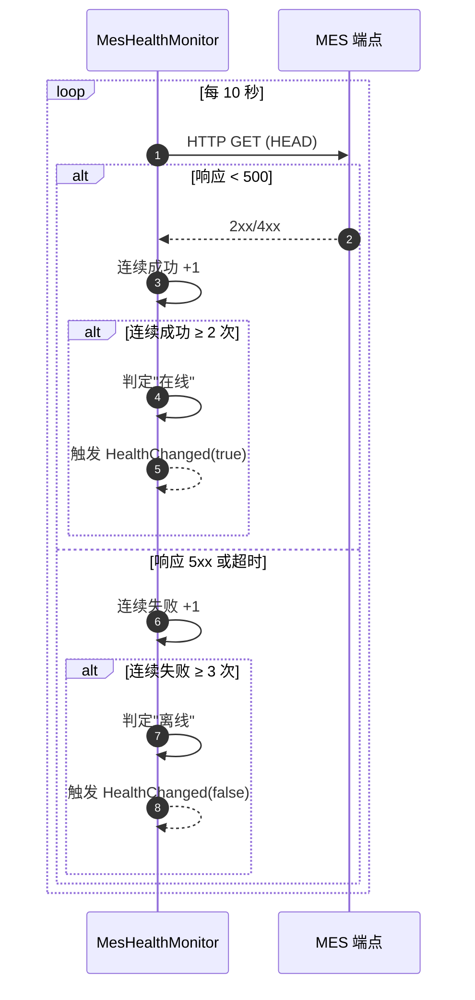
```mermaid
sequenceDiagram
    autonumber
    participant HM as MesHealthMonitor
    participant MES as MES 端点

    loop 每 10 秒
        HM->>MES: HTTP GET (HEAD)
        alt 响应 < 500
            MES-->>HM: 2xx/4xx
            HM->>HM: 连续成功 +1
            alt 连续成功 ≥ 2 次
                HM->>HM: 判定"在线"
                HM-->>HM: 触发 HealthChanged(true)
            end
        else 响应 5xx 或超时
            HM->>HM: 连续失败 +1
            alt 连续失败 ≥ 3 次
                HM->>HM: 判定"离线"
                HM-->>HM: 触发 HealthChanged(false)
            end
        end
    end
```

---

## 📡 Modbus 协议详解

### 视觉服务器寄存器映射

| 地址 | 名称 | 读/写 | 说明 |
|------|------|-------|------|
| **100** | 触发线圈 | W | 客户端写 `1` 触发拍照；服务端处理完自动清 `0` |
| **101** | 忙状态 | R | `1` = 正在处理；`0` = 空闲 |
| **102** | 整体结果 | R | `1` = OK；`0` = NG |
| **1000** | 结果码 | R | `0`=OK, `3`=NG, `1`=故障, `2`=相机未连接, `99`=系统错误 |
| **1003** | 直径 × 100 | R | 例如 `2015` = `20.15 mm` |
| **1004** | 缺陷数 | R | 缺陷计数 |
| **1005** | X 坐标 × 100 | R | Int16 有符号，例如 `-2734` = `-27.34 mm` |
| **1006** | Y 坐标 × 100 | R | Int16 有符号，例如 `-1576` = `-15.76 mm` |
| **1007** | 目标数量 | R | 检测到的目标个数 |

### 有符号数处理

Modbus 寄存器本身是**无符号 16 位**（0 ~ 65535），但坐标可能是负数。

**写入（服务端 → 寄存器）**：

```csharp
double value = -27.34;
ushort raw = (ushort)(short)Math.Round(value * 100, MidpointRounding.AwayFromZero);
// value * 100 = -2734, (short) = -2734, (ushort) = 62802 = 0xF552
_registers.WritePoints(1005, new ushort[] { raw });
```

**读取（寄存器 → 客户端）**：

```csharp
ushort raw = master.ReadHoldingRegisters(slave, 1005, 1)[0];
short signed = (short)raw;   // 0xF552 → -2734
double value = signed / 100.0;  // -27.34
```

⚠️ **注意**：`NModbus` 返回的 `ushort[]` **已经是寄存器内的原始值**，不要再做字节交换。常见错误是在读取时多交换一次字节。

### 通信时序

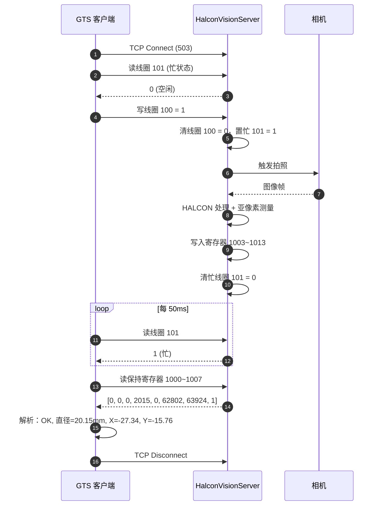
```mermaid
sequenceDiagram
    autonumber
    participant Client as GTS 客户端
    participant Vision as HalconVisionServer
    participant Camera as 相机

    Client->>Vision: TCP Connect (503)
    Client->>Vision: 读线圈 101 (忙状态)
    Vision-->>Client: 0 (空闲)
    Client->>Vision: 写线圈 100 = 1
    Vision->>Vision: 清线圈 100 = 0，置忙 101 = 1
    Vision->>Camera: 触发拍照
    Camera-->>Vision: 图像帧
    Vision->>Vision: HALCON 处理 + 亚像素测量
    Vision->>Vision: 写入寄存器 1003~1013
    Vision->>Vision: 清忙线圈 101 = 0
    loop 每 50ms
        Client->>Vision: 读线圈 101
        Vision-->>Client: 1 (忙)
    end
    Client->>Vision: 读保持寄存器 1000~1007
    Vision-->>Client: [0, 0, 0, 2015, 0, 62802, 63924, 1]
    Client->>Client: 解析：OK, 直径=20.15mm, X=-27.34, Y=-15.76
    Client->>Vision: TCP Disconnect
```

### 常见错误排查

| 现象 | 原因 | 解决方案 |
|------|------|----------|
| **连不上 503 端口** | 端口被 Modbus Slave 占用 | 关闭 Modbus Slave，改用 Modbus Poll |
| **读到全 0** | 未触发拍照 / 从站未写入 | 先写线圈 100 = 1 触发一次 |
| **读到 540.23 而非 20.03** | 客户端做了多余字节交换 | 去掉 `ConvertRawToType` 的字节交换 |
| **坐标显示 62802 而非 -27.34** | 未做有符号转换 | 读取后 `(short)raw` |
| **值误差 0.01mm** | 服务端用截断而非四舍五入 | 服务端改 `Math.Round` |

---

## 🔧 扩展点

| 扩展点 | 位置 | 方法 |
|--------|------|------|
| **新增工作流命令** | `Commands/` | 实现 `IMotionCommand`，在 `CommandFactory` 注册 |
| **新增 PLC 品牌** | `Services/Plc/` | 实现 `IPlcClient`，在 `PlcManager.CreateClient` 注册 |
| **新增数据库** | `Data/DbContextFactory.cs` | 在 `ConfigureOptions` 添加 `case` |
| **新增 MES 协议** | `Services/Mes/MesReportService.cs` | 添加 `PostToMesByXxxAsync` 方法 |
| **新增串口帧格式** | `Services/Serial/Frames/` | 实现 `ISerialFrameParser`，在 `CreateParser` 注册 |

---

## 🧪 测试报告摘要

### 数据库多适配测试

| 数据库 | 检查项 | 结果 |
|--------|--------|------|
| SQLite | 自动建库/建表/用户 CRUD | ✅ |
| SQL Server (LocalDB) | 连接/自动建表/数据隔离 | ✅ |
| MySQL / MariaDB | utf8mb4/中文读写/自动建表 | ✅ |

**结论**：三数据库通过 `appsettings.json` 一键切换，业务代码零修改。

### RS232/485 串口驱动测试

- **虚拟串口对**：COM7 ↔ COM8（com0com）
- **测试工具**：UartAssist V5.0.14
- **帧格式**：原始流 / 分隔符（`\r\n`）/ 定长（8 字节）/ 头+长度（`AA 55` + 长度 + CRC16）
- **自动重连**：拔插虚拟串口 3 秒后自动重连 ✅

### Siemens S7 PLC 驱动测试

- **PLC 模拟器**：Snap7 Server Demo 1.4.2，监听 `0.0.0.0:102`
- **连接**：S7-1200 / Rack=0 / Slot=1 ✅
- **读写**：`DB1.DBW0` = 0 → 写 1234 → 读回 1234 ✅
- **类型覆盖**：Bool / Short / UShort / Int / Float / Double ✅
- **自动重连**：关闭/重启 Snap7 → 5 秒内自动重连 ✅

### MES 上报测试

- **REST 模式**：Python Flask `http://localhost:8888/api/mes`，连续 10 条上报全部成功 ✅
- **SOAP 模式**：Python 标准库 `http://127.0.0.1:8080/`，SOAP 1.1 Envelope 构造/解析正确 ✅
- **离线缓存**：关闭 MES → 5 条数据全部缓存 → 重启 MES → 健康监控判定在线后自动全量重传 ✅
- **配置热重载**：REST → SOAP 无需重启 ✅

### 视觉服务集成测试

- **测量对象**：20mm 金属圆片
- **算法**：HALCON 亚像素边缘 + `ahuber` 鲁棒圆拟合 + 5 帧中位数
- **重复性**：极差 15~20 μm，标准差 3~5 μm
- **Modbus 数据一致性**：直径/坐标/缺陷数与视觉服务端完全一致 ✅

### 综合性能

| 场景 | 性能指标 |
|------|----------|
| 单设备工作流循环（Home → MoveAbs → TriggerVision → Delay） | 约 1.2 秒/轮 |
| 3 设备并行循环 | 无相互阻塞，各设备独立线程 |
| MES 上报吞吐 | 约 2 条/秒（REST） |
| 内存占用（3 设备 + MES + 视觉） | 稳定在 150 MB 左右 |

### 稳定性

- **连续运行 8 小时**：无内存泄漏，无崩溃
- **工作流循环 1000 轮**：全部成功，无漏拍
- **MES 断连/恢复 10 次**：全部自动恢复，无数据丢失
- **PLC 断连/恢复 5 次**：全部自动重连成功

---

## 🔧 待开发功能

| 功能 | 接口/类 | 优先级 | 说明 |
|------|---------|--------|------|
| **报警 UI 列表** | `Form1` 报警列表控件 | 高 | 报警管理后端已完成，需添加 UI 列表显示 |
| **MQTT 发布器（扩展）** | `IMqttPublisher` | 中 | 将设备状态、报警、生产数据通过 MQTT 推送至云端 |
| **生产统计报表** | `Services/ReportService` | 低 | 按日/周/月生成产量报表 |
| **远程诊断** | `Services/RemoteDiagnostic` | 低 | 通过 TCP/WebSocket 实现远程日志查看 |

---

## 🤝 贡献指南

### 新增命令类型

1. 在 `Commands/` 目录下创建新类，实现 `IMotionCommand` 接口
2. 继承 `MotionCommandBase` 并实现 `ExecuteCore` 方法
3. 在 `CommandFactory.cs` 的 `Create` 方法中注册新命令类型
4. 在 `CommandConfigDialog` 中添加对应的 UI 配置项

### 新增通信协议

参考 `Services/Plc/` 或 `Services/Serial/` 的目录结构，创建接口 + 实现 + 管理器三件套。

### 代码规范

- 遵循 C# 编码规范
- 使用 `AppLogger` 记录关键操作
- 所有公共 API 需包含 XML 文档注释

---

## 📄 许可证

[MIT](LICENSE)

---

**Made with ❤️ for industrial automation**